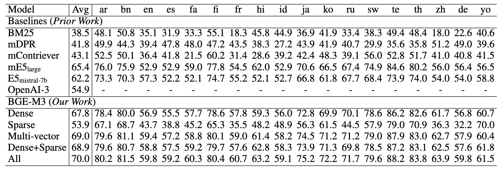
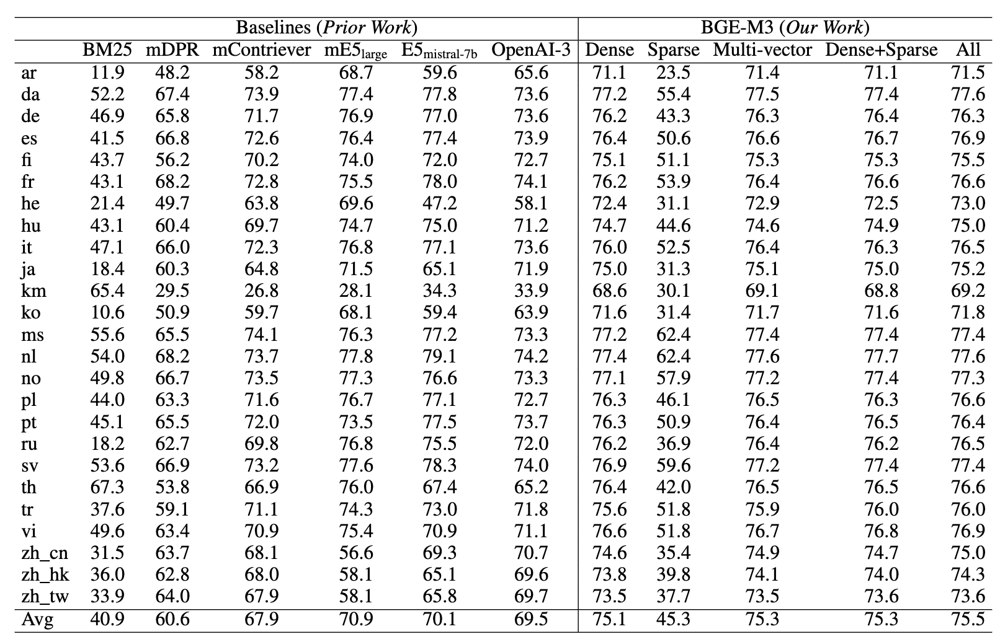
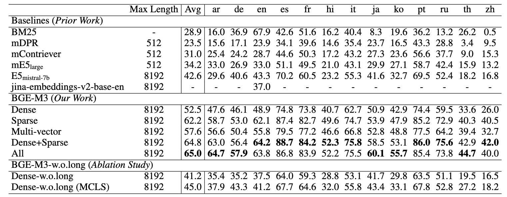
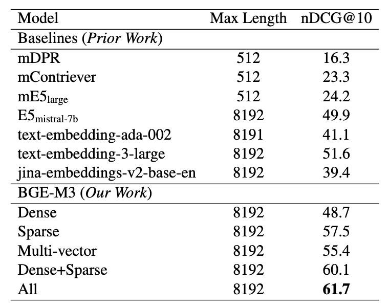

# BGE-M3
In this project, we introduce BGE-M3, which is distinguished for its versatility in Multi-Functionality, Multi-Linguality, and Multi-Granularity. 
- Multi-Functionality: It can simultaneously perform the three common retrieval functionalities of embedding model: dense retrieval, multi-vector retrieval, and sparse retrieval. 
- Multi-Linguality: It can support more than 100 working languages. 
- Multi-Granularity: It is able to process inputs of different granularities, spanning from short sentences to long documents of up to 8192 tokens. 

**Some suggestions for retrieval pipeline in RAG:**
We recommend to use following pipeline: hybrid retrieval + re-ranking. 
- Hybrid retrieval leverages the strengths of various methods, offering higher accuracy and stronger generalization capabilities. 
A classic example: using both embedding retrieval and the BM25 algorithm. 
Now, you can try to use BGE-M3, which supports both embedding and sparse retrieval. 
This allows you to obtain token weights (similar to the BM25) without any additional cost when generate dense embeddings.
- As cross-encoder models, re-ranker demonstrates higher accuracy than bi-encoder embedding model. 
Utilizing the re-ranking model (e.g., [bge-reranker](https://github.com/FlagOpen/FlagEmbedding/tree/master/FlagEmbedding/reranker), [cohere-reranker](https://txt.cohere.com/rerank/)) after retrieval can further filter the selected text.

## News:
- 2/1/2024: **Thanks for the excellent tool from Vespa.** You can easily use multiple modes of BGE-M3 following this [notebook](https://github.com/vespa-engine/pyvespa/blob/master/docs/sphinx/source/examples/mother-of-all-embedding-models-cloud.ipynb)


## FAQ

**1. Introduction for different retrieval methods**

- Dense retrieval: map the text into a single embedding, e.g., [DPR](https://arxiv.org/abs/2004.04906), [BGE-v1.5](https://github.com/FlagOpen/FlagEmbedding)
- Sparse retrieval (lexical matching): a vector of size equal to the vocabulary, with the majority of positions set to zero, calculating a weight only for tokens present in the text. e.g., BM25, [unicoil](https://arxiv.org/pdf/2106.14807.pdf), and [splade](https://arxiv.org/abs/2107.05720)
- Multi-vector retrieval: use multiple vectors to represent a text, e.g., [ColBERT](https://arxiv.org/abs/2004.12832).

**2. Comparison with BGE-v1.5 and other monolingual models**

BGE-M3 is a multilingual model, and its ability in monolingual embedding retrieval may not surpass models specifically designed for single languages. 
However, we still recommend trying BGE-M3 because of its versatility (support for multiple languages and long texts). 
Moreover, it can simultaneously generate multiple representations, and using them together can enhance accuracy and generalization, 
unlike most existing models that can only perform dense retrieval. 

In the open-source community, there are many excellent models (e.g., jina-embedding, colbert, e5, etc), 
and users can choose a model that suits their specific needs based on practical considerations, 
such as whether to require multilingual or cross-language support, and whether to process long texts.

**3. How to use BGE-M3 in other projects?**

For embedding retrieval, you can employ the BGE-M3 model using the same approach as BGE. 
The only difference is that the BGE-M3 model no longer requires adding instructions to the queries. 
For sparse retrieval methods, most open-source libraries currently do not support direct utilization of the BGE-M3 model. 
Contributions from the community are welcome. 

**Now you can ou can try the BGE-M3 in [Vespa](https://github.com/vespa-engine/pyvespa/blob/master/docs/sphinx/source/examples/mother-of-all-embedding-models-cloud.ipynb
). Thanks @jobergum.**

**4. How to fine-tune bge-M3 model?**

You can follow the common in this [example](https://github.com/FlagOpen/FlagEmbedding/tree/master/examples/finetune) 
to fine-tune the dense embedding.

Our code and data for unified fine-tuning (dense, sparse, and multi-vectors) will be released.


## Usage

Install: 
```
git clone https://github.com/FlagOpen/FlagEmbedding.git
cd FlagEmbedding
pip install -e .
```
or: 
```
pip install -U FlagEmbedding
```


### Generate Embedding for text

- Dense Embedding
```python
from FlagEmbedding import BGEM3FlagModel

model = BGEM3FlagModel('BAAI/bge-m3',  
                       use_fp16=True) # Setting use_fp16 to True speeds up computation with a slight performance degradation

sentences_1 = ["What is BGE M3?", "Defination of BM25"]
sentences_2 = ["BGE M3 is an embedding model supporting dense retrieval, lexical matching and multi-vector interaction.", 
               "BM25 is a bag-of-words retrieval function that ranks a set of documents based on the query terms appearing in each document"]

embeddings_1 = model.encode(sentences_1, 
                            batch_size=12, 
                            max_length=8192, # If you don't need such a long length, you can set a smaller value to speed up the encoding process.
                            )['dense_vecs']
embeddings_2 = model.encode(sentences_2)['dense_vecs']
similarity = embeddings_1 @ embeddings_2.T
print(similarity)
# [[0.6265, 0.3477], [0.3499, 0.678 ]]
```
You also can use sentence-transformers and huggingface transformers to generate dense embeddings.
Refer to [baai_general_embedding](https://github.com/FlagOpen/FlagEmbedding/tree/master/FlagEmbedding/baai_general_embedding#usage) for details.


- Sparse Embedding (Lexical Weight)
```python
from FlagEmbedding import BGEM3FlagModel

model = BGEM3FlagModel('BAAI/bge-m3',  use_fp16=True) # Setting use_fp16 to True speeds up computation with a slight performance degradation

sentences_1 = ["What is BGE M3?", "Defination of BM25"]
sentences_2 = ["BGE M3 is an embedding model supporting dense retrieval, lexical matching and multi-vector interaction.", 
               "BM25 is a bag-of-words retrieval function that ranks a set of documents based on the query terms appearing in each document"]

output_1 = model.encode(sentences_1, return_dense=True, return_sparse=True, return_colbert_vecs=False)
output_2 = model.encode(sentences_2, return_dense=True, return_sparse=True, return_colbert_vecs=False)

# you can see the weight for each token:
print(model.convert_id_to_token(output_1['lexical_weights']))
# [{'What': 0.08356, 'is': 0.0814, 'B': 0.1296, 'GE': 0.252, 'M': 0.1702, '3': 0.2695, '?': 0.04092}, 
#  {'De': 0.05005, 'fin': 0.1368, 'ation': 0.04498, 'of': 0.0633, 'BM': 0.2515, '25': 0.3335}]


# compute the scores via lexical mathcing
lexical_scores = model.compute_lexical_matching_score(output_1['lexical_weights'][0], output_2['lexical_weights'][0])
print(lexical_scores)
# 0.19554901123046875

print(model.compute_lexical_matching_score(output_1['lexical_weights'][0], output_1['lexical_weights'][1]))
# 0.0
```

- Multi-Vector (ColBERT)
```python
from FlagEmbedding import BGEM3FlagModel

model = BGEM3FlagModel('BAAI/bge-m3',  use_fp16=True) 

sentences_1 = ["What is BGE M3?", "Defination of BM25"]
sentences_2 = ["BGE M3 is an embedding model supporting dense retrieval, lexical matching and multi-vector interaction.", 
               "BM25 is a bag-of-words retrieval function that ranks a set of documents based on the query terms appearing in each document"]

output_1 = model.encode(sentences_1, return_dense=True, return_sparse=True, return_colbert_vecs=True)
output_2 = model.encode(sentences_2, return_dense=True, return_sparse=True, return_colbert_vecs=True)

print(model.colbert_score(output_1['colbert_vecs'][0], output_2['colbert_vecs'][0]))
print(model.colbert_score(output_1['colbert_vecs'][0], output_2['colbert_vecs'][1]))
# 0.7797
# 0.4620
```


### Compute score for text pairs
Input a list of text pairs, you can get the scores computed by different methods.
```python
from FlagEmbedding import BGEM3FlagModel

model = BGEM3FlagModel('BAAI/bge-m3',  use_fp16=True) 

sentences_1 = ["What is BGE M3?", "Defination of BM25"]
sentences_2 = ["BGE M3 is an embedding model supporting dense retrieval, lexical matching and multi-vector interaction.", 
               "BM25 is a bag-of-words retrieval function that ranks a set of documents based on the query terms appearing in each document"]

sentence_pairs = [[i,j] for i in sentences_1 for j in sentences_2]

print(model.compute_score(sentence_pairs, 
                          max_passage_length=128, # a smaller max length leads to a lower latency
                          weights_for_different_modes=[0.4, 0.2, 0.4])) # weights_for_different_modes(w) is used to do weighted sum: w[0]*dense_score + w[1]*sparse_score + w[2]*colbert_score

# {
#   'colbert': [0.7796499729156494, 0.4621465802192688, 0.4523794651031494, 0.7898575067520142], 
#   'sparse': [0.195556640625, 0.00879669189453125, 0.0, 0.1802978515625], 
#   'dense': [0.6259765625, 0.347412109375, 0.349853515625, 0.67822265625], 
#   'sparse+dense': [0.482503205537796, 0.23454029858112335, 0.2332356721162796, 0.5122477412223816], 
#   'colbert+sparse+dense': [0.6013619303703308, 0.3255828022956848, 0.32089319825172424, 0.6232916116714478]
# }
```


## Evaluation  

- Multilingual (Miracl dataset) 



- Cross-lingual (MKQA dataset)



- Long Document Retrieval
  - MLDR:
  
  Please note that MLDR is a document retrieval dataset we constructed via LLM, 
  covering 13 languages, including test set, validation set, and training set. 
  We utilized the training set from MLDR to enhance the model's long document retrieval capabilities. 
  Therefore, comparing baseline with `Dense w.o.long`(fine-tuning without long document dataset) is more equitable. 
  Additionally, this long document retrieval dataset will be open-sourced to address the current lack of open-source multilingual long text retrieval datasets.
  We believe that this data will be helpful for the open-source community in training document retrieval models.

  - NarritiveQA:  
  

## Training
- Self-knowledge Distillation: combining multiple outputs from different 
retrieval modes as reward signal to enhance the performance of single mode(especially for sparse retrieval and multi-vec(colbert) retrival)
- Efficient Batching: Improve the efficiency when fine-tuning on long text. 
The small-batch strategy is simple but effective, which also can used to fine-tune large embedding model.
- MCLS: A simple method to improve the performance on long text without fine-tuning. 
If you have no enough resource to fine-tuning model with long text, the method is useful.

Refer to our [report](https://github.com/FlagOpen/FlagEmbedding/blob/master/FlagEmbedding/BGE_M3/BGE_M3.pdf) for more details.

**The fine-tuning codes and datasets will be open-sourced in the near future.**

## Models

We release two versions:
- [BAAI/bge-m3-unsupervised](https://huggingface.co/BAAI/bge-m3-unsupervised): the model after contrastive learning in a large-scale dataset
- [BAAI/bge-m3](https://huggingface.co/BAAI/bge-m3): the final model fine-tuned from BAAI/bge-m3-unsupervised

## Acknowledgement

Thanks the authors of open-sourced datasets, including Miracl, MKQA, NarritiveQA, etc.  

## Citation

If you find this repository useful, please consider giving a star :star: and citation

```

```


