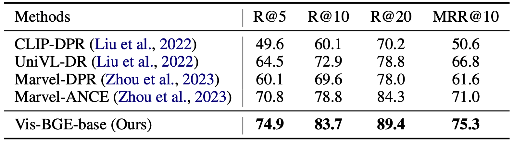
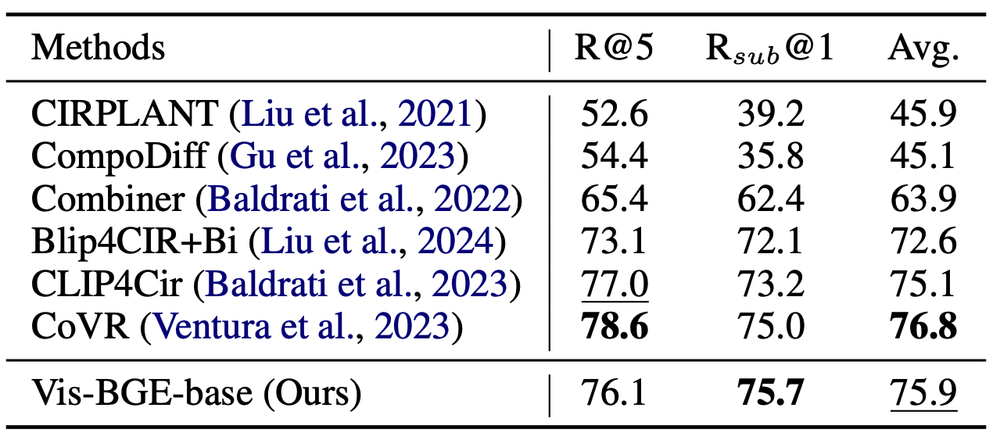

<h1 align="center">Visualized BGE</h1>

<p align="center">
    <a href="https://arxiv.org/abs/2406.04292">
            
    </a>
    <a href="https://github.com/FlagOpen/FlagEmbedding/tree/master/FlagEmbedding/visual">
        
    </a>
    <a href="https://huggingface.co/BAAI/bge-visualized">
        
    </a>
    <a href="https://huggingface.co/datasets/JUNJIE99/VISTA_S2">
        
    </a>
</p>

## 🔔 News
**[2024.3.18] We have released our code and model.**

**[2024.6.7] We have released our paper. [Arxiv Link](https://arxiv.org/abs/2406.04292)**

**[2024.6.13] We have released [VISTA-S2 dataset](https://huggingface.co/datasets/JUNJIE99/VISTA_S2), a hybrid multi-modal dataset consisting of over 500,000 instances for multi-modal training (Stage-2 training in our paper).**

## Introduction
In this project, we introduce Visualized-BGE, a universal multi-modal embedding model. By incorporating image token embedding into the BGE Text Embedding framework, Visualized-BGE gains the flexibility to process multi-modal data that goes beyond just text. Visualized-BGE is mainly used for hybrid modal retrieval tasks, including but not limited to:

- Multi-Modal Knowledge Retrieval (query: text; candidate: image-text pairs, text, or image)  e.g. [WebQA](https://github.com/WebQnA/WebQA)
- Composed Image Retrieval (query: image-text pair; candidate: images) e.g. [CIRR](), [FashionIQ]()
- Knowledge Retrieval with Multi-Modal Queries (query: image-text pair; candidate: texts) e.g. [ReMuQ]()

Moreover, Visualized BGE fully preserves the strong text embedding capabilities of the original BGE model : )

## Specs
### Model
| **Model Name** | **Dimension** | **Text Embedding Model** | **Language** | **Weight** |
| --- | --- | --- | --- | --- |
| BAAI/bge-visualized-base-en-v1.5 | 768 | [BAAI/bge-base-en-v1.5](https://huggingface.co/BAAI/bge-base-en-v1.5) | English | [🤗 HF link](https://huggingface.co/BAAI/bge-visualized/blob/main/Visualized_base_en_v1.5.pth) |
| BAAI/bge-visualized-m3 | 1024 | [BAAI/bge-m3](https://huggingface.co/BAAI/bge-m3) | Multilingual | [🤗 HF link](https://huggingface.co/BAAI/bge-visualized/blob/main/Visualized_m3.pth) |


### Data
We have generated a hybrid multi-modal dataset consisting of over 500,000 instances for multi-modal training (Stage-2 training in our paper). You can download our dataset from this [🤗 HF Link](https://huggingface.co/datasets/JUNJIE99/VISTA_S2). 
Process the image compression package with the following commands:

```bash
cat images.tar.part* > images.tar
tar -xvf images.tar
```
If you obtain the following directory structure. You can then use the annotation information (json files) for your own training:
```
images
|__coco
|__edit_image
```

## Usage
### Installation:
#### Install FlagEmbedding:
```
git clone https://github.com/FlagOpen/FlagEmbedding.git
cd FlagEmbedding
pip install -e .
```
#### Another Core Packages:
```
pip install torchvision timm einops ftfy
```
You don't need to install `xformer` and `apex`. They are not essential for inference and can often cause issues.

### Generate Embedding for Multi-Modal Data:
Visualized-BGE provides the versatility to encode multi-modal data in a variety of formats, whether it's purely text, solely image-based, or a combination of both.

> **Note:** Please download the model weight file ([bge-visualized-base-en-v1.5](https://huggingface.co/BAAI/bge-visualized/resolve/main/Visualized_base_en_v1.5.pth?download=true), [bge-visualized-m3](https://huggingface.co/BAAI/bge-visualized/resolve/main/Visualized_m3.pth?download=true)) in advance and pass the path to the `model_weight` parameter.

- Composed Image Retrieval
``` python
####### Use Visualized BGE doing composed image retrieval
import torch
from FlagEmbedding.visual.modeling import Visualized_BGE

model = Visualized_BGE(model_name_bge = "BAAI/bge-base-en-v1.5", model_weight="path: Visualized_base_en_v1.5.pth")
model.eval()
with torch.no_grad():
    query_emb = model.encode(image="./imgs/cir_query.png", text="Make the background dark, as if the camera has taken the photo at night")
    candi_emb_1 = model.encode(image="./imgs/cir_candi_1.png")
    candi_emb_2 = model.encode(image="./imgs/cir_candi_2.png")

sim_1 = query_emb @ candi_emb_1.T
sim_2 = query_emb @ candi_emb_2.T
print(sim_1, sim_2) # tensor([[0.8750]]) tensor([[0.7816]])
```

- Multi-Modal Knowledge Retrieval
``` python
####### Use Visualized BGE doing multi-modal knowledge retrieval
import torch
from FlagEmbedding.visual.modeling import Visualized_BGE

model = Visualized_BGE(model_name_bge = "BAAI/bge-base-en-v1.5", model_weight="path: Visualized_base_en_v1.5.pth")
model.eval()
with torch.no_grad():
    query_emb = model.encode(text="Are there sidewalks on both sides of the Mid-Hudson Bridge?")
    candi_emb_1 = model.encode(text="The Mid-Hudson Bridge, spanning the Hudson River between Poughkeepsie and Highland.", image="./imgs/wiki_candi_1.jpg")
    candi_emb_2 = model.encode(text="Golden_Gate_Bridge", image="./imgs/wiki_candi_2.jpg")
    candi_emb_3 = model.encode(text="The Mid-Hudson Bridge was designated as a New York State Historic Civil Engineering Landmark by the American Society of Civil Engineers in 1983. The bridge was renamed the \"Franklin Delano Roosevelt Mid-Hudson Bridge\" in 1994.")

sim_1 = query_emb @ candi_emb_1.T
sim_2 = query_emb @ candi_emb_2.T
sim_3 = query_emb @ candi_emb_3.T
print(sim_1, sim_2, sim_3) # tensor([[0.6932]]) tensor([[0.4441]]) tensor([[0.6415]])
```
- Multilingual Multi-Modal Retrieval
``` python
##### Use M3 doing Multilingual Multi-Modal Retrieval
import torch
from FlagEmbedding.visual.modeling import Visualized_BGE

model = Visualized_BGE(model_name_bge = "BAAI/bge-m3", model_weight="path: Visualized_m3.pth")
model.eval()
with torch.no_grad():
    query_emb = model.encode(image="./imgs/cir_query.png", text="一匹马牵着这辆车")
    candi_emb_1 = model.encode(image="./imgs/cir_candi_1.png")
    candi_emb_2 = model.encode(image="./imgs/cir_candi_2.png")

sim_1 = query_emb @ candi_emb_1.T
sim_2 = query_emb @ candi_emb_2.T
print(sim_1, sim_2) # tensor([[0.7026]]) tensor([[0.8075]])
```

## Evaluation Result
Visualized BGE delivers outstanding zero-shot performance across multiple hybrid modal retrieval tasks. It can also serve as a base model for downstream fine-tuning for hybrid modal retrieval tasks.
#### Zero-shot Performance
- Statistical information of the zero-shot multi-modal retrieval benchmark datasets. During the zero-shot evaluation, we utilize the queries from the validation or test set of each dataset to perform retrieval assessments within the entire corpus of the respective dataset.


- Zero-shot evaluation results with Recall@5 on various hybrid multi-modal retrieval benchmarks. The -MM notation indicates baseline models that have undergone multi-modal training on our generated data.


#### Fine-tuning on Downstream Tasks
- Supervised fine-tuning performance on the WebQA dataset. All retrievals are performed on the entire deduplicated corpus.

- Supervised fine-tuning performance on the CIRR test set.

- Supervised fine-tuning performance on the ReMuQ test set.

## FAQ

**Q1: Can Visualized BGE be used for cross-modal retrieval (text to image)?**

A1: While it is technically possible, it's not the recommended use case. Our model focus on augmenting hybrid modal retrieval tasks with visual capabilities.

## Acknowledgement
The image token embedding model in this project is built upon the foundations laid by [EVA-CLIP](https://github.com/baaivision/EVA/tree/master/EVA-CLIP).

## Citation
If you find this repository useful, please consider giving a star ⭐ and citation
```
@article{zhou2024vista,
  title={VISTA: Visualized Text Embedding For Universal Multi-Modal Retrieval},
  author={Zhou, Junjie and Liu, Zheng and Xiao, Shitao and Zhao, Bo and Xiong, Yongping},
  journal={arXiv preprint arXiv:2406.04292},
  year={2024}
}
```
