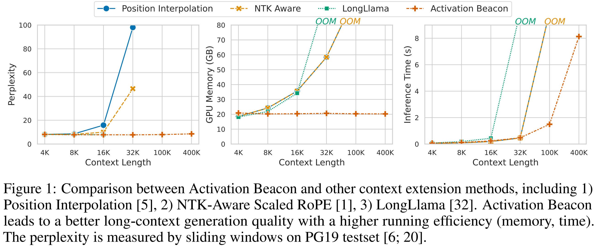

<div align="center">
<h1>Soaring from 4K to 400K: Extending LLM's Context with Activation Beacon [<a href="">paper</a>]</h1>


</div>


This is the codebase for Activation Beacon, an effective, efficient, compatible, and low-cost (training) method to extend the context length of LLM.

*The source code and model checkpoint will be released soon. Please stay tuned.*:smile: 


## Contact
If you have any question or suggestion related to this project, feel free to open an issue or pull request. You also can email Peitian Zhang (namespace.pt@gmail.com).

## Citation
If you find this repository useful, please give us a star ⭐.

To cite our work:
```
@misc{

}
```