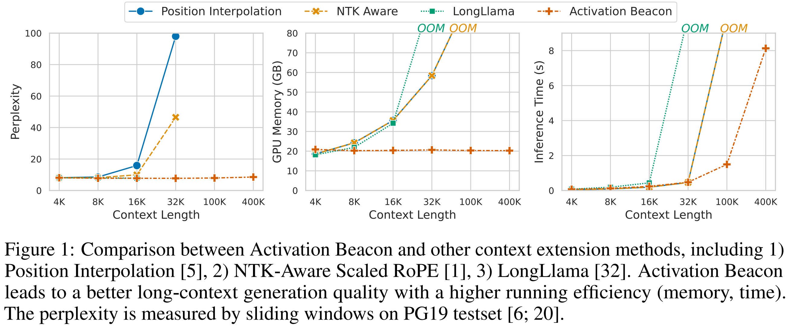

<div align="center">
<h1>Soaring from 4K to 400K: Extending LLM's Context with Activation Beacon [<a href="https://arxiv.org/abs/2401.03462">paper</a>]</h1>

</div>

## Features

Activation Beacon is remarkable for the following features:
- **Effectiveness**
  - significantly improves the performance of Llama-2 on long-context generation (language modeling) and long-context understanding (e.g. long-document QA).
- **Efficiency**
  - low memory usage; low inference latency (compeitive against FlashAttention2); inference latency increases linearly with the input length.
- **Compatibility**
  - preserve the short-context capability of Llama-2;
  - can be combined with context window extension techniques for futher context extension (e.g. 1M with NTK-Aware); 
  - can be combined with retrieval for higher memory accuracy (*ongoing*).
- **Low-Cost Training**
  - train with 80000 texts within 9 hours;
  - most training samples are shorter than 4096.


## Environment
The main dependencies are:
```
pytorch==2.1.2 transformers==4.36.1 accelerate==0.25.0 datasets==2.14.7 numpy==1.26.2 flash-attn==2.4.2
```
You can install our environment with:
```bash
conda env create -f environment.yaml --name activation-beacon
```

## Usage
```python
import json
import torch
from transformers import AutoModelForCausalLM, AutoTokenizer

model_id = "namespace-Pt/activation-beacon-llama2-7b-chat"

tokenizer = AutoTokenizer.from_pretrained(model_id, trust_remote_code=True)
model = AutoModelForCausalLM.from_pretrained(model_id, trust_remote_code=True, torch_dtype=torch.bfloat16)

model = model.cuda().eval()

with torch.no_grad():
  # short context
  text = "Tell me about yourself."
  inputs = tokenizer(text, return_tensors="pt").to("cuda")
  outputs = model.generate(**inputs, max_new_tokens=20)
  print(f"Input Length: {inputs['input_ids'].shape[1]}")
  print(f"Output:       {tokenizer.decode(outputs[0], skip_special_tokens=True)}")

  # reset memory before new generation task
  model.memory.reset()

  # long context
  with open("data/toy/narrativeqa.json", encoding="utf-8") as f:
    example = json.load(f)
  inputs = tokenizer(example["context"], return_tensors="pt").to("cuda")
  outputs = model.generate(**inputs, do_sample=False, top_p=1, temperature=1, max_new_tokens=20)[:, inputs["input_ids"].shape[1]:]
  print("*"*20)
  print(f"Input Length: {inputs['input_ids'].shape[1]}")
  print(f"Answer:       {example['answer']}")
  print(f"Prediction:   {tokenizer.decode(outputs[0], skip_special_tokens=True)}")
```
**NOTE**: It's okay to see warnings like `This is a friendly reminder - the current text generation call will exceed the model's predefined maximum length (4096). Depending on the model, you may observe exceptions, performance degradation, or nothing at all.` Just ignore it.

## Training
See [training section](./docs/training.md).

## Evaluation
See [evaluation section](./docs/evaluation.md).

## Citation
If you find this repository useful, please give us a star ⭐.

To cite our work:
```
@misc{zhang2024soaring,
    title={Soaring from 4K to 400K: Extending LLM's Context with Activation Beacon}, 
    author={Peitian Zhang and Zheng Liu and Shitao Xiao and Ninglu Shao and Qiwei Ye and Zhicheng Dou},
    year={2024},
    eprint={2401.03462},
    archivePrefix={arXiv},
    primaryClass={cs.CL}
}
```
