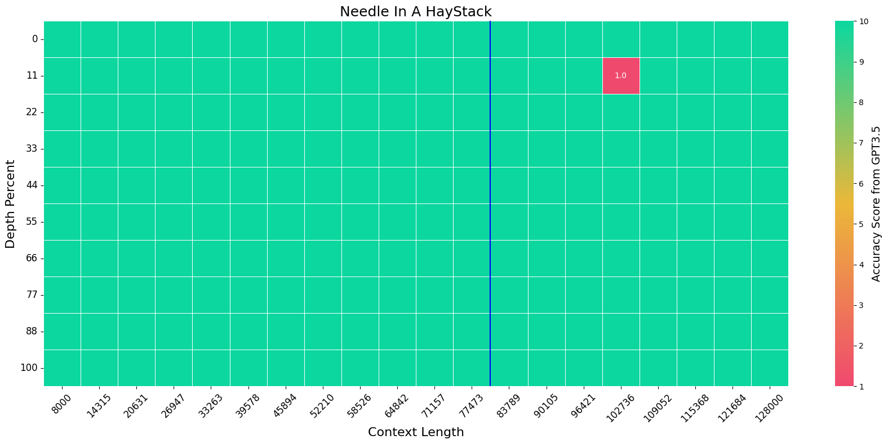

<div align="center">
<h1>Extending Llama-3's Context Ten-Fold Overnight</h1> 

[<a href="https://huggingface.co/namespace-Pt/Llama-3-8B-Instruct-80K-QLoRA">LoRA Model</a>] [<a href="https://huggingface.co/namespace-Pt/Llama-3-8B-Instruct-80K-QLoRA-Merged">Merged Model</a>]


</div>

We extend the context length of Llama-3-8B-Instruct from 8K to 80K via QLoRA fine-tuning. The entire training cycle is super efficient, which takes 8 hours on one 8xA800 (80G) GPU machine. The resulted model exhibits superior performances across a broad range of evaluation tasks, such as NIHS, topic retrieval, and long-context language understanding; meanwhile, it also preserves the original capability over short contexts. The dramatic context extension is mainly attributed to merely 3.5K synthetic data generated by GPT-4, which indicates the LLMs' inherent (yet largely underestimated) potential to extend its original context length. In fact, the context length could be extended far beyond 80K with more computing resources.


# Environment
```bash
conda create -n unsloth python=3.10
conda activate unsloth

conda install pytorch==2.2.2 pytorch-cuda=12.1 cudatoolkit xformers -c pytorch -c nvidia -c xformers
pip install transformers==4.39.3 deepspeed accelerate datasets==2.18.0 peft bitsandbytes
pip install flash-attn --no-build-isolation
pip install "unsloth[colab-new] @ git+https://github.com/unslothai/unsloth.git"

# these packages are used in evaluation
pip install rouge fuzzywuzzy jieba pandas seaborn python-Levenshtein
```

**NOTE**: you must modify the source code of `unsloth` so that you can set the `rope_theta` correctly in training. Go to `$ENC_LOCATION$/lib/python3.10/site-packages/unsloth/models/llama.py`, comment all lines from `1080-1088`. The results should be like:
```python
# if (rope_scaling is None) and (max_seq_length > model_max_seq_length):
#     rope_scaling = max_seq_length / model_max_seq_length
#     logger.warning_once(
#         f"Unsloth: {model_name} can only handle sequence lengths of at most "\
#         f"{model_max_seq_length}.\nBut with kaiokendev's RoPE scaling of "\
#         f"{round(rope_scaling, 3)}, it can be magically be extended to "\
#         f"{max_seq_length}!"
#     )
#     rope_scaling = {"type": "linear", "factor": rope_scaling,}
```

Full-attention models cannot run with more than 60K context length on a single A800 GPU. Parallel strategies are required. We use [`tensor_parallel`](https://github.com/BlackSamorez/tensor_parallel). However, `tensor_parallel` does not support `transformers>=4.36`. You should create another environment while downgrade to `transformers==4.35.1` and install `tensor_parallel`:
```bash
conda create -n full --clone unsloth
conda activate full

pip install transformers==4.35.1 datasets==2.14.5 tensor_parallel
```

# Data
You should download the data for fine-tuning & evaluation then untar the file at anywhere you prefer, e.g. `/data`, which results in a folder `/data/long-llm`:
```bash
# feel free to alternate /data to your prefered location
wget https://huggingface.co/datasets/namespace-Pt/projects/resolve/main/long-llm.tar.gz?download=true -O /data/long-llm.tar.gz

cd /data
tar -xzvf long-llm.tar.gz
```

**IMPORTANT NOTE**

For any path specified for `train_data` and `eval_data`: if it is prefixed with `long-llm:`, it will be solved to the relative path against `data_root`. 
  - for example, `long-llm:redpajama/train.json` -> `${data_root}/redpajama/train.json`
  - you can modify the default value of [`data_root`](src/args.py), so that you don't need to type it for each command.


# Training

**NOTE: `unsloth` does not support DDP training now despite they used to in May 2024. So the training script won't work. You're encouraged to open a feature request in the [unsloth repo](https://github.com/unslothai/unsloth). Or, you can try to use some other framework for efficient tuning, like MegatronLM. More details can be found in [this issue](https://github.com/FlagOpen/FlagEmbedding/issues/919).**

```bash
export PYTORCH_CUDA_ALLOC_CONF=expandable_segments:True

output_name=qlora-llama3_chat-gpt_longalpaca_redpajama5000-unsloth

torchrun --nproc_per_node 8 -m main.train \
--data_root /data/long-llm \
--output_dir data/outputs/$output_name \
--model_name_or_path meta-llama/Meta-Llama-3-8B-Instruct \
--train_data long-llm:gpt/one_detail_book.train.64K.json long-llm:gpt/one_detail_paper.train.64K.json long-llm:gpt/multi_detail_book.train.json long-llm:gpt/multi_detail_paper_short.train.json long-llm:gpt/multi_detail_paper_long.train.json long-llm:gpt/bio_book.train.json long-llm:longalpaca/train.json long-llm:redpajama/train.json[5000] \
--max_length 81920 \
--group_by_length \
--rope_theta 200e6 \
--attn_impl flash_attention_2 \
--gradient_checkpointing \
--use_reentrant True \
--learning_rate 5e-5 \
--num_train_epochs 1 \
--save_only_model \
--save_strategy epoch \
--logging_steps 5 \
--bf16 \
--lora_tune \
--lora_extra_params embed_tokens \
--load_in_4_bit \
--chat_template llama-3
```

Note that `unsloth` will automatically download their quantized version of `Llama-3-8B-Insturct` in the first training run. No warry. Just download it.


# Evaluation

All evaluation results will be saved at `data/results/`.

## LoRA Model
```bash
export PYTORCH_CUDA_ALLOC_CONF=expandable_segments:True

# base model id
model=meta-llama/Meta-Llama-3-8B-Instruct
# lora model id
lora=namespace-Pt/Llama-3-8B-Instruct-80K-QLoRA

COMMAND="--data_root /data/long-llm --model_name_or_path $model --lora $lora --rope_theta 200e6 --attn_impl flash_attention_2 --chat_template llama-3"

source /opt/conda/bin/activate unsloth

torchrun --nproc_per_node 8 -m main.eval_longbench --max_length 31500 $COMMAND
torchrun --nproc_per_node 8 -m main.eval_topic $COMMAND
torchrun --nproc_per_node 8 -m main.eval_mmlu $COMMAND

source /opt/conda/bin/activate full

python -m main.eval_needle $COMMAND --min_length 8000 --max_length 80000 --enable_tp
python -m main.eval_infbench $COMMAND --max_length 80000 --enable_tp

# you can use GPT3.5 as the scorer with the following command:
# export OPENAI_API_KEY="sk-xxxx"
# python -m main.eval_needle $COMMAND --min_length 8000 --max_length 80000 --enable_tp --gpt_eval
```


## Full Model
```bash
export PYTORCH_CUDA_ALLOC_CONF=expandable_segments:True

# model id
model=gradientai/Llama-3-8B-Instruct-262k

COMMAND="--data_root /data/long-llm --model_name_or_path $model --chat_template llama-3 --attn_impl flash_attention_2"

source /opt/conda/bin/activate unsloth

torchrun --nproc_per_node 8 -m main.eval_longbench --max_length 31500 $COMMAND
torchrun --nproc_per_node 8 -m main.eval_topic $COMMAND
torchrun --nproc_per_node 8 -m main.eval_mmlu $COMMAND

source /opt/conda/bin/activate full

python -m main.eval_needle $COMMAND --min_length 8000 --max_length 80000 --enable_tp
python -m main.eval_infbench $COMMAND --max_length 80000 --enable_tp

# you can use GPT3.5 as the scorer with the following command:
# export OPENAI_API_KEY="sk-xxxx"
# python -m main.eval_needle $COMMAND --min_length 8000 --max_length 80000 --enable_tp --gpt_eval
```

# Usage

You can load the model in two ways. Either loading the LoRA adapter then merge the LoRA adapter onto Llama-3-8B-Instruct, or directly load the merged model.

## LoRA Model
```python
import json
import torch
from transformers import AutoModelForCausalLM, AutoTokenizer
from peft import PeftModel

model_id = "meta-llama/Meta-Llama-3-8B-Instruct"
peft_id = "namespace-Pt/Llama-3-8B-Instruct-80K-QLoRA"

torch_dtype = torch.bfloat16
# place the model on GPU
device_map = {"": "cuda"}

tokenizer = AutoTokenizer.from_pretrained(model_id)

base_model = AutoModelForCausalLM.from_pretrained(
  model_id, 
  torch_dtype=torch.bfloat16,
  device_map=device_map,
  attn_implementation="flash_attention_2",

  # NOTE: expand rope base
  rope_theta=200e6,
)

model = PeftModel.from_pretrained(
    base_model, 
    peft_id,
    torch_dtype=torch.bfloat16,
    device_map=device_map,
)
# NOTE: merge LoRA weights
model = model.merge_and_unload().eval()

with torch.no_grad():
  # short context
  messages = [{"role": "user", "content": "Tell me about yourself."}]
  inputs = tokenizer.apply_chat_template(messages, tokenize=True, add_generation_prompt=True, return_tensors="pt", return_dict=True).to("cuda")
  outputs = model.generate(**inputs, max_new_tokens=50)[:, inputs["input_ids"].shape[1]:]
  print(f"Input Length: {inputs['input_ids'].shape[1]}")
  print(f"Output:       {tokenizer.decode(outputs[0])}")

  # long context
  with open("data/narrativeqa.json", encoding="utf-8") as f:
    example = json.load(f)
  messages = [{"role": "user", "content": example["context"]}]
  inputs = tokenizer.apply_chat_template(messages, tokenize=True, add_generation_prompt=True, return_tensors="pt", return_dict=True).to("cuda")
  outputs = model.generate(**inputs, do_sample=False, top_p=1, temperature=1, max_new_tokens=20)[:, inputs["input_ids"].shape[1]:]
  print("*"*20)
  print(f"Input Length: {inputs['input_ids'].shape[1]}")
  print(f"Answers:      {example['answer']}")
  print(f"Prediction:   {tokenizer.decode(outputs[0])}")
```
You may observe messages like:
`This is a friendly reminder - the current text generation call will exceed the model's predefined maximum length (8192). Depending on the model, you may observe exceptions, performance degradation, or nothing at all.` or `Setting pad_token_id to eos_token_id:128001 for open-end generation`. They do not matter. Just ignore them.

## Full Model
```python
import json
import torch
from transformers import AutoModelForCausalLM, AutoTokenizer

model_id = "namespace-Pt/Llama-3-8B-Instruct-80K-QLoRA-Merged"

torch_dtype = torch.bfloat16
# place the model on GPU
device_map = {"": "cuda"}

tokenizer = AutoTokenizer.from_pretrained(model_id)

model = AutoModelForCausalLM.from_pretrained(
  model_id, 
  torch_dtype=torch.bfloat16,
  device_map=device_map,
  attn_implementation="flash_attention_2",
).eval()

with torch.no_grad():
  # short context
  messages = [{"role": "user", "content": "Tell me about yourself."}]
  inputs = tokenizer.apply_chat_template(messages, tokenize=True, add_generation_prompt=True, return_tensors="pt", return_dict=True).to("cuda")
  outputs = model.generate(**inputs, max_new_tokens=50)[:, inputs["input_ids"].shape[1]:]
  print(f"Input Length: {inputs['input_ids'].shape[1]}")
  print(f"Output:       {tokenizer.decode(outputs[0])}")

  # long context
  with open("data/narrativeqa.json", encoding="utf-8") as f:
    example = json.load(f)
  messages = [{"role": "user", "content": example["context"]}]
  inputs = tokenizer.apply_chat_template(messages, tokenize=True, add_generation_prompt=True, return_tensors="pt", return_dict=True).to("cuda")
  outputs = model.generate(**inputs, do_sample=False, top_p=1, temperature=1, max_new_tokens=20)[:, inputs["input_ids"].shape[1]:]
  print("*"*20)
  print(f"Input Length: {inputs['input_ids'].shape[1]}")
  print(f"Answers:      {example['answer']}")
  print(f"Prediction:   {tokenizer.decode(outputs[0])}")
```
You may observe messages like:
`This is a friendly reminder - the current text generation call will exceed the model's predefined maximum length (8192). Depending on the model, you may observe exceptions, performance degradation, or nothing at all.` or `Setting pad_token_id to eos_token_id:128001 for open-end generation`. They do not matter. Just ignore them.


# TODO
- [x] release training data
- [ ] release data generation pipeline

# Citation
If you find this repository useful, please give us a star ⭐.

To cite our work:
```
@misc{zhang2024extending,
      title={Extending Llama-3's Context Ten-Fold Overnight}, 
      author={Peitian Zhang and Ninglu Shao and Zheng Liu and Shitao Xiao and Hongjin Qian and Qiwei Ye and Zhicheng Dou},
      year={2024},
      eprint={2404.19553},
      archivePrefix={arXiv},
      primaryClass={cs.CL}
}
```
