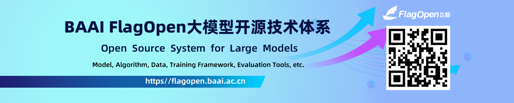

[](https://flagopen.baai.ac.cn/)

<h1 align="center">⚡️BGE: One-Stop Retrieval Toolkit For Search and RAG</h1>


<p align="center">
    <a href="https://huggingface.co/collections/BAAI/bge-66797a74476eb1f085c7446d">
        
    </a>
    <a href="https://github.com/FlagOpen/FlagEmbedding">
            
    </a>
    <a href="https://github.com/FlagOpen/FlagEmbedding/blob/master/LICENSE">
        
    </a>
    <a href="https://huggingface.co/C-MTEB">
        
    </a>
    <a href="https://github.com/FlagOpen/FlagEmbedding/tree/master/research/baai_general_embedding">
        
    </a>
</p>
<h4 align="center">
    <p>
        <a href=#news>News</a> |
        <a href=#installation>Installation</a> |
        <a href=#quick-start>Quick Start</a> |
        <a href=#community>Community</a> |
        <a href="https://github.com/FlagOpen/FlagEmbedding/tree/master/research">Projects</a> |
        <a href=#model-list>Model List</a> |
        <a href="#contributors">Contributor</a> |
        <a href="#citation">Citation</a> |
        <a href="#license">License</a> 
    <p>
</h4>


[English](README.md) | [中文](https://github.com/FlagOpen/FlagEmbedding/blob/master/README_zh.md)


BGE (BAAI General Embedding) focuses on retrieval-augmented LLMs, consisting of the following projects currently:


- **Inference**: [Embedder](https://github.com/FlagOpen/FlagEmbedding/tree/master/examples/inference/embedder), [Reranker](https://github.com/FlagOpen/FlagEmbedding/tree/master/examples/inference/reranker)
- **Finetune**: [Embedder](https://github.com/FlagOpen/FlagEmbedding/tree/master/examples/finetune/embedder), [Reranker](https://github.com/FlagOpen/FlagEmbedding/tree/master/examples/finetune/reranker)
- **[Evaluation](https://github.com/FlagOpen/FlagEmbedding/tree/master/examples/evaluation)**
- **[Dataset](https://github.com/FlagOpen/FlagEmbedding/tree/master/dataset)**
- **[Tutorials](https://github.com/FlagOpen/FlagEmbedding/tree/master/Tutorials)**
- **[research](https://github.com/FlagOpen/FlagEmbedding/tree/master/research)**

## News

- 05/12/2024: :book: We built the [BGE documentation](www.bge-model.com) for centralized BGE information and materials!
- 10/29/2024: :earth_asia: We created WeChat group for BGE. Scan the [QR code](./imgs/BGE_WeChat_Group.png) to join the group chat! To get the first hand message about our updates and new release, or having any questions or ideas, join us now!
- 

- 10/22/2024:  :fire: We release another interesting model: [OmniGen](https://github.com/VectorSpaceLab/OmniGen), which is a unified image generation model supporting various tasks. OmniGen can accomplish complex image generation tasks without the need for additional plugins like ControlNet, IP-Adapter, or auxiliary models such as pose detection and face detection.
- 9/10/2024: Introducing **MemoRAG**, a step forward towards RAG 2.0 on top of memory-inspired knowledge discovery (repo: https://github.com/qhjqhj00/MemoRAG, paper: https://arxiv.org/pdf/2409.05591v1) :fire:
- 9/2/2024: Start to maintain the [tutorials](./Tutorials/). The contents within will be actively updated and eariched, stay tuned! :books:
- 7/26/2024: Release a new embedding model [bge-en-icl](https://huggingface.co/BAAI/bge-en-icl), an embedding model that incorporates in-context learning capabilities, which, by providing task-relevant query-response examples, can encode semantically richer queries, further enhancing the semantic representation ability of the embeddings. :fire:
- 7/26/2024: Release a new embedding model [bge-multilingual-gemma2](https://huggingface.co/BAAI/bge-multilingual-gemma2), a multilingual embedding model based on gemma-2-9b, which supports multiple languages and diverse downstream tasks, achieving new SOTA on multilingual benchmarks (MIRACL, MTEB-fr, and MTEB-pl). :fire:
- 7/26/2024: Release a new lightweight reranker [bge-reranker-v2.5-gemma2-lightweight](https://huggingface.co/BAAI/bge-reranker-v2.5-gemma2-lightweight), a lightweight reranker based on gemma-2-9b, which supports token compression and layerwise lightweight operations, can still ensure good performance while saving a significant amount of resources. :fire:

<details>
  <summary>More</summary>
<!-- ### More -->

- 6/7/2024: Release a new benchmark [MLVU](https://github.com/JUNJIE99/MLVU), the first comprehensive benchmark specifically designed for long video understanding. MLVU features an extensive range of video durations, a diverse collection of video sources, and a set of evaluation tasks uniquely tailored for long-form video understanding. :fire:
- 5/21/2024: Release a new benchmark [AIR-Bench](https://github.com/AIR-Bench/AIR-Bench) together with Jina AI, Zilliz, HuggingFace, and other partners. AIR-Bench focuses on a fair out-of-distribution evaluation for Neural IR & RAG. It generates the synthetic data for benchmarking w.r.t. diverse domains and languages. It is dynamic and will be updated on regular basis. [Leaderboard](https://huggingface.co/spaces/AIR-Bench/leaderboard) :fire:
- 4/30/2024: Release [Llama-3-8B-Instruct-80K-QLoRA](https://huggingface.co/namespace-Pt/Llama-3-8B-Instruct-80K-QLoRA), extending the context length of Llama-3-8B-Instruct from 8K to 80K via QLoRA training on a few synthesized long-context data. The model achieves remarkable performance on various long-context benchmarks. [Code](https://github.com/FlagOpen/FlagEmbedding/tree/master/research/Long_LLM/longllm_qlora) :fire:
- 3/18/2024: Release new [rerankers](https://github.com/FlagOpen/FlagEmbedding/tree/master/research/llm_reranker), built upon powerful M3 and LLM (GEMMA and MiniCPM, not so large actually :smiley:) backbones, supporitng multi-lingual processing and larger inputs, massive improvements of ranking performances on BEIR, C-MTEB/Retrieval, MIRACL, LlamaIndex Evaluation :fire:
- 3/18/2024: Release [Visualized-BGE](https://github.com/FlagOpen/FlagEmbedding/tree/master/research/visual_bge), equipping BGE with visual capabilities. Visualized-BGE can be utilized to generate embeddings for hybrid image-text data. :fire:
- 1/30/2024: Release **BGE-M3**, a new member to BGE model series! M3 stands for **M**ulti-linguality (100+ languages), **M**ulti-granularities (input length up to 8192), **M**ulti-Functionality (unification of dense, lexical, multi-vec/colbert retrieval). 
It is the first embedding model which supports all three retrieval methods, achieving new SOTA on multi-lingual (MIRACL) and cross-lingual (MKQA) benchmarks.
[Technical Report](https://arxiv.org/pdf/2402.03216.pdf) and [Code](https://github.com/FlagOpen/FlagEmbedding/tree/master/research/BGE_M3). :fire:
- 1/9/2024: Release [Activation-Beacon](https://github.com/FlagOpen/FlagEmbedding/tree/master/research/Long_LLM/activation_beacon), an effective, efficient, compatible, and low-cost (training) method to extend the context length of LLM. [Technical Report](https://arxiv.org/abs/2401.03462) 
- 12/24/2023: Release **LLaRA**, a LLaMA-7B based dense retriever, leading to state-of-the-art performances on MS MARCO and BEIR. Model and code will be open-sourced. Please stay tuned. [Technical Report](https://arxiv.org/abs/2312.15503) and [Code](https://github.com/FlagOpen/FlagEmbedding/tree/master/research/LLARA)
- 11/23/2023: Release [LM-Cocktail](https://github.com/FlagOpen/FlagEmbedding/tree/master/research/LM_Cocktail), a method to maintain general capabilities during fine-tuning by merging multiple language models. [Technical Report](https://arxiv.org/abs/2311.13534) 
- 10/12/2023: Release [LLM-Embedder](https://github.com/FlagOpen/FlagEmbedding/tree/master/research/llm_embedder), a unified embedding model to support diverse retrieval augmentation needs for LLMs. [Technical Report](https://arxiv.org/pdf/2310.07554.pdf)
- 09/15/2023: The [technical report](https://arxiv.org/pdf/2309.07597.pdf) of BGE has been released 
- 09/15/2023: The [massive training data](https://data.baai.ac.cn/details/BAAI-MTP) of BGE has been released 
- 09/12/2023: New models: 
    - **New reranker model**: release cross-encoder models `BAAI/bge-reranker-base` and `BAAI/bge-reranker-large`, which are more powerful than embedding model. We recommend to use/fine-tune them to re-rank top-k documents returned by embedding models. 
    - **update embedding model**: release `bge-*-v1.5` embedding model to alleviate the issue of the similarity distribution, and enhance its retrieval ability without instruction.
- 09/07/2023: Update [fine-tune code](https://github.com/FlagOpen/FlagEmbedding/tree/master/research/baai_general_embedding): Add script to mine hard negatives and support adding instruction during fine-tuning. 
- 08/09/2023: BGE Models are integrated into **Langchain**, you can use it like [this](#using-langchain); C-MTEB **leaderboard** is [available](https://huggingface.co/spaces/mteb/leaderboard).  
- 08/05/2023: Release base-scale and small-scale models, **best performance among the models of the same size 🤗**  
- 08/02/2023: Release `bge-large-*`(short for BAAI General Embedding) Models, **rank 1st on MTEB and C-MTEB benchmark!** :tada: :tada:   
- 08/01/2023: We release the [Chinese Massive Text Embedding Benchmark](https://github.com/FlagOpen/FlagEmbedding/tree/master/research/C_MTEB) (**C-MTEB**), consisting of 31 test dataset.  
  

</details>

## Installation
### Using pip:
If you do not want to finetune the models, you can install the package without the finetune dependency:
```
pip install -U FlagEmbedding
```
If you want to finetune the models, you can install the package with the finetune dependency:
```
pip install -U FlagEmbedding[finetune]
```
### Install from sources:

Clone the repository and install
```
git clone https://github.com/FlagOpen/FlagEmbedding.git
cd FlagEmbedding
# If you do not need to finetune the models, you can install the package without the finetune dependency:
pip install  .
# If you want to finetune the models, install the package with the finetune dependency:
# pip install  .[finetune]
```
For development in editable mode:
```
# If you do not need to finetune the models, you can install the package without the finetune dependency:
pip install -e .
# If you want to finetune the models, install the package with the finetune dependency:
# pip install -e .[finetune]
```

## Quick Start
First, load one of the BGE embedding model:
```
from FlagEmbedding import FlagAutoModel

model = FlagAutoModel.from_finetuned('BAAI/bge-base-en-v1.5',
                                      query_instruction_for_retrieval="Represent this sentence for searching relevant passages:",
                                      use_fp16=True)
```
Then, feed some sentences to the model and get their embeddings:
```
sentences_1 = ["I love NLP", "I love machine learning"]
sentences_2 = ["I love BGE", "I love text retrieval"]
embeddings_1 = model.encode(sentences_1)
embeddings_2 = model.encode(sentences_2)
```
Once we get the embeddings, we can compute similarity by inner product:
```
similarity = embeddings_1 @ embeddings_2.T
print(similarity)
```

For more details, you can refer to [embedder inference](./examples/inference/embedder), [reranker inference](./examples/inference/reranker), [embedder finetune](./examples/finetune/embedder), [reranker fintune](./examples/finetune/reranker), [evaluation](./examples/evaluation).

If you're unfamiliar with any of related concepts, please check out the [tutorial](./Tutorials/). If it's not there, let us know.

For more interesting topics related to BGE, take a look at [research](./research).

## Community

We are actively maintaining the community of BGE and FlagEmbedding. Let us know if you have any suggessions or ideas!

Currently we are updating the [tutorials](./Tutorials/), we aim to create a comprehensive and detailed tutorial for beginners on text retrieval and RAG. Stay tuned!

The following contents are releasing in the upcoming weeks:

- Evaluation
- BGE-EN-ICL

<details>
  <summary>The whole tutorial roadmap</summary>
    
</details>

## Model List

`bge` is short for `BAAI general embedding`.

| Model                                                                     | Language |                                                             Description                                                             |                                query instruction for retrieval                                 |
|:--------------------------------------------------------------------------|:--------:|:-----------------------------------------------------------------------------------------------------------------------------------:|:----------------------------------------------------------------------------------------------:|
| [BAAI/bge-en-icl](https://huggingface.co/BAAI/bge-en-icl) | English | A LLM-based embedding model with in-context learning capabilities, which can fully leverage the model's potential based on a few shot examples | Provide instructions and few-shot examples freely based on the given task. |
| [BAAI/bge-multilingual-gemma2](https://huggingface.co/BAAI/bge-multilingual-gemma2) |    Multilingual     | A LLM-based multilingual embedding model, trained on a diverse range of languages and tasks. |        Provide instructions based on the given task.         |
| [BAAI/bge-m3](https://huggingface.co/BAAI/bge-m3)                   |    Multilingual     | Multi-Functionality(dense retrieval, sparse retrieval, multi-vector(colbert)), Multi-Linguality, and Multi-Granularity(8192 tokens) |  |
| [LM-Cocktail](https://huggingface.co/Shitao)                   |   English |                     fine-tuned models (Llama and BGE) which can be used to reproduce the results of LM-Cocktail                     |  |
| [BAAI/llm-embedder](https://huggingface.co/BAAI/llm-embedder)             |   English |                         a unified embedding model to support diverse retrieval augmentation needs for LLMs                          | See [README](https://github.com/FlagOpen/FlagEmbedding/tree/master/research/llm_embedder) |
| [BAAI/bge-reranker-v2-m3](https://huggingface.co/BAAI/bge-reranker-v2-m3) | Multilingual | a lightweight cross-encoder model, possesses strong multilingual capabilities, easy to deploy, with fast inference. |  |
| [BAAI/bge-reranker-v2-gemma](https://huggingface.co/BAAI/bge-reranker-v2-gemma) | Multilingual | a cross-encoder model which is suitable for multilingual contexts, performs well in both English proficiency and multilingual capabilities. |  |
| [BAAI/bge-reranker-v2-minicpm-layerwise](https://huggingface.co/BAAI/bge-reranker-v2-minicpm-layerwise) | Multilingual | a cross-encoder model which is suitable for multilingual contexts, performs well in both English and Chinese proficiency, allows freedom to select layers for output, facilitating accelerated inference. |  |
| [BAAI/bge-reranker-v2.5-gemma2-lightweight](https://huggingface.co/BAAI/bge-reranker-v2.5-gemma2-lightweight) | Multilingual | a cross-encoder model which is suitable for multilingual contexts, performs well in both English and Chinese proficiency, allows freedom to select layers, compress ratio and compress layers for output, facilitating accelerated inference. |  |
| [BAAI/bge-reranker-large](https://huggingface.co/BAAI/bge-reranker-large) |   Chinese and English |                                   a cross-encoder model which is more accurate but less efficient                                   |                                                                                                |
| [BAAI/bge-reranker-base](https://huggingface.co/BAAI/bge-reranker-base)   |   Chinese and English |                                   a cross-encoder model which is more accurate but less efficient                                   |                                                                                                |
| [BAAI/bge-large-en-v1.5](https://huggingface.co/BAAI/bge-large-en-v1.5)   |   English |                                      version 1.5 with more reasonable similarity distribution                                       |                  `Represent this sentence for searching relevant passages: `                   |
| [BAAI/bge-base-en-v1.5](https://huggingface.co/BAAI/bge-base-en-v1.5)     |   English |                                      version 1.5 with more reasonable similarity distribution                                       |                  `Represent this sentence for searching relevant passages: `                   |
| [BAAI/bge-small-en-v1.5](https://huggingface.co/BAAI/bge-small-en-v1.5)   |   English |                                      version 1.5 with more reasonable similarity distribution                                       |                  `Represent this sentence for searching relevant passages: `                   |
| [BAAI/bge-large-zh-v1.5](https://huggingface.co/BAAI/bge-large-zh-v1.5)   |   Chinese |                                      version 1.5 with more reasonable similarity distribution                                       |                                     `为这个句子生成表示以用于检索相关文章：`                                      |
| [BAAI/bge-base-zh-v1.5](https://huggingface.co/BAAI/bge-base-zh-v1.5)     |   Chinese |                                      version 1.5 with more reasonable similarity distribution                                       |                                     `为这个句子生成表示以用于检索相关文章：`                                      |
| [BAAI/bge-small-zh-v1.5](https://huggingface.co/BAAI/bge-small-zh-v1.5)   |   Chinese |                                      version 1.5 with more reasonable similarity distribution                                       |                                     `为这个句子生成表示以用于检索相关文章：`                                      |
| [BAAI/bge-large-en](https://huggingface.co/BAAI/bge-large-en)             |   English |                                             Embedding Model which map text into vector                                              |                  `Represent this sentence for searching relevant passages: `                   |
| [BAAI/bge-base-en](https://huggingface.co/BAAI/bge-base-en)               |   English |                                    a base-scale model but with similar ability to `bge-large-en`                                    |                  `Represent this sentence for searching relevant passages: `                   |
| [BAAI/bge-small-en](https://huggingface.co/BAAI/bge-small-en)             |   English |                                        a small-scale model but with competitive performance                                         |                  `Represent this sentence for searching relevant passages: `                   |
| [BAAI/bge-large-zh](https://huggingface.co/BAAI/bge-large-zh)             |   Chinese |                                             Embedding Model which map text into vector                                              |                                     `为这个句子生成表示以用于检索相关文章：`                                      |
| [BAAI/bge-base-zh](https://huggingface.co/BAAI/bge-base-zh)               |   Chinese |                                    a base-scale model but with similar ability to `bge-large-zh`                                    |                                     `为这个句子生成表示以用于检索相关文章：`                                      |
| [BAAI/bge-small-zh](https://huggingface.co/BAAI/bge-small-zh)             |   Chinese |                                        a small-scale model but with competitive performance                                         |                                     `为这个句子生成表示以用于检索相关文章：`                                      |


### Contributors:
Thank all our contributors for their efforts and warmly welcome new members to join in!

<a href="https://github.com/FlagOpen/FlagEmbedding/graphs/contributors">
  
</a>


## Citation

If you find this repository useful, please consider giving a star :star: and citation

```
@misc{bge_m3,
  title={BGE M3-Embedding: Multi-Lingual, Multi-Functionality, Multi-Granularity Text Embeddings Through Self-Knowledge Distillation},
  author={Chen, Jianlv and Xiao, Shitao and Zhang, Peitian and Luo, Kun and Lian, Defu and Liu, Zheng},
  year={2023},
  eprint={2309.07597},
  archivePrefix={arXiv},
  primaryClass={cs.CL}
}

@misc{cocktail,
      title={LM-Cocktail: Resilient Tuning of Language Models via Model Merging}, 
      author={Shitao Xiao and Zheng Liu and Peitian Zhang and Xingrun Xing},
      year={2023},
      eprint={2311.13534},
      archivePrefix={arXiv},
      primaryClass={cs.CL}
}

@misc{llm_embedder,
      title={Retrieve Anything To Augment Large Language Models}, 
      author={Peitian Zhang and Shitao Xiao and Zheng Liu and Zhicheng Dou and Jian-Yun Nie},
      year={2023},
      eprint={2310.07554},
      archivePrefix={arXiv},
      primaryClass={cs.IR}
}

@misc{bge_embedding,
      title={C-Pack: Packaged Resources To Advance General Chinese Embedding}, 
      author={Shitao Xiao and Zheng Liu and Peitian Zhang and Niklas Muennighoff},
      year={2023},
      eprint={2309.07597},
      archivePrefix={arXiv},
      primaryClass={cs.CL}
}
```

## License
FlagEmbedding is licensed under the [MIT License](https://github.com/FlagOpen/FlagEmbedding/blob/master/LICENSE). 

