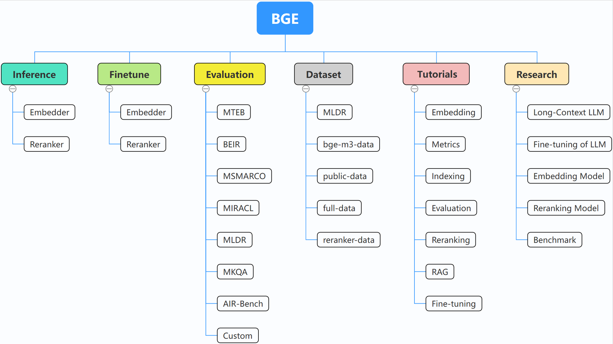

<h1 align="center">⚡️BGE: One-Stop Retrieval Toolkit For Search and RAG</h1>
<p align="center">
    <a href="https://huggingface.co/collections/BAAI/bge-66797a74476eb1f085c7446d">
        
    </a>
    <a href="https://github.com/FlagOpen/FlagEmbedding">
            
    </a>
    <a href="https://github.com/FlagOpen/FlagEmbedding/blob/master/LICENSE">
        
    </a>
    <a href="https://huggingface.co/C-MTEB">
        
    </a>
    <a href="https://github.com/FlagOpen/FlagEmbedding/tree/master/research/baai_general_embedding">
        
    </a>
</p>


<h4 align="center">
    <p>
        <a href=#更新>更新</a> |
        <a href=#安装>安装</a> |
        <a href=#快速开始>快速开始</a> |
        <a href=#社区>社区</a> |
        <a href="https://github.com/FlagOpen/FlagEmbedding/tree/master/research">项目</a> |
        <a href="#模型列表">模型列表</a> |
        <a href=#贡献者>贡献者</a> |
        <a href="#citation">Citation</a> |
        <a href="#license">License</a> 
    <p>
</h4>

[English](https://github.com/FlagOpen/FlagEmbedding/blob/master/README.md) | [中文](https://github.com/FlagOpen/FlagEmbedding/blob/master/README_zh.md)

BGE (BAAI General Embedding) 专注于检索增强llm领域，目前包括以下项目:



- **推理**: [Embedder](https://github.com/FlagOpen/FlagEmbedding/tree/master/examples/inference/embedder), [Reranker](https://github.com/FlagOpen/FlagEmbedding/tree/master/examples/inference/reranker)
- **微调**: [Embedder](https://github.com/FlagOpen/FlagEmbedding/tree/master/examples/finetune/embedder), [Reranker](https://github.com/FlagOpen/FlagEmbedding/tree/master/examples/finetune/reranker)
- **[评估](https://github.com/FlagOpen/FlagEmbedding/tree/master/examples/evaluation)**
- **[数据集](https://github.com/FlagOpen/FlagEmbedding/tree/master/dataset)**
- **[教程](https://github.com/FlagOpen/FlagEmbedding/tree/master/Tutorials)**
- **[研究](https://github.com/FlagOpen/FlagEmbedding/tree/master/research)**

## 更新

- 10/29/2024: :earth_asia: 我们建立了[BGE技术交流群](./BGE_WeChat_Group.png)，欢迎扫码入群！
- 
- 10/22/2024：我们发布了新的模型：[OmniGen](https://github.com/VectorSpaceLab/OmniGen)，这是一个支持各种任务的统一图像生成模型。OmniGen可以在不需要额外插件（如ControlNet、IP-Adapter）或辅助模型（如姿态检测和人脸检测）的情况下完成复杂的图像生成任务。 :fire:
- 9/10/2024：我们推出了**MemoRAG**，这是一种基于记忆启发的知识发现技术，是迈向 RAG 2.0 的关键一步（仓库：https://github.com/qhjqhj00/MemoRAG，论文：https://arxiv.org/pdf/2409.05591v1） :fire:
- 9/2/2024: 开始维护更新[教程](./Tutorials/)，教程文件夹中的内容会在未来不断丰富，欢迎持续关注！ :books:
- 7/26/2024：发布[bge-en-icl](https://huggingface.co/BAAI/bge-en-icl)。这是一个结合了上下文学习能力的文本检索模型，通过提供与任务相关的查询-回答示例，可以编码语义更丰富的查询，进一步增强嵌入的语义表征能力。 :fire:
- 7/26/2024: 发布[bge-multilingual-gemma2](https://huggingface.co/BAAI/bge-multilingual-gemma2)。这是一个基于gemma-2-9b的多语言文本向量模型，同时支持多种语言和多样的下游任务，在多语言检索数据集 MIRACL, MTEB-fr, MTEB-pl 上取得了迄今最好的实验结果。 :fire:
- 7/26/2024：发布新的轻量级重排器[bge-reranker-v2.5-gemma2-lightweight](https://huggingface.co/BAAI/bge-reranker-v2.5-gemma2-lightweight)。这是一个基于gemma-2-9b的轻量级重排器，支持令牌压缩和分层轻量操作，在节省大量资源的同时，仍能确保良好的性能。:fire:

<details>
  <summary>More</summary>

- 6/7/2024: 发布首个专为长视频理解设计的全面评测基准[MLVU](https://github.com/JUNJIE99/MLVU)。MLVU拥有丰富的视频时长范围，多样化的视频来源，以及多个专为长视频理解设计的评估任务。 :fire:
- 5/21/2024：联合 Jina AI、Zilliz、HuggingFace 等机构发布评测基准 [AIR-Bench](https://github.com/AIR-Bench/AIR-Bench)，针对检索任务和 RAG 场景设计。AIR-Bench 首次提出在检索任务中使用 LLMs 自动化生产评估数据，避免模型过拟合测试数据。AIR-Bench 不需要人工参与标注数据，因而可以更灵活覆盖更多垂直领域和不同语种。同时 AIR-Bench 会定期进行更新从而满足社区不断变化的评测需求。[Leaderboard](https://huggingface.co/spaces/AIR-Bench/leaderboard) :fire:
- 4/30/2024: 发布[Llama-3-8B-Instruct-80K-QLoRA](https://huggingface.co/namespace-Pt/Llama-3-8B-Instruct-80K-QLoRA), 其通过在少量合成的长文本数据上的QLoRA训练，有效地将Llama-3-8B-Instruct的上下文长度从8K扩展到80K。详见[代码](https://github.com/FlagOpen/FlagEmbedding/tree/master/research/Long_LLM/longllm_qlora) :fire:
- 3/18/2024: 发布新的[rerankers](https://github.com/FlagOpen/FlagEmbedding/tree/master/research/llm_reranker), 拥有更好的性能同时支持多语言和长文本。 :fire:
- 3/18/2024: 发布[Visualized-BGE](https://github.com/FlagOpen/FlagEmbedding/tree/master/research/visual_bge)，该项目通过引入image token embedding赋予BGE视觉编码能力。Visualized-BGE可以对混合图文数据进行编码，用于广泛的混合模态检索任务。 :fire:
- 1/30/2024: 发布**BGE-M3**, 第一个具有多功能、多语言和多粒度特性的文本检索模型，高效支持多语言（100+语言）、长文本（至多8192长度的输入文本）、和混合检索（稠密、稀疏、多向量）。 详见[report](https://github.com/FlagOpen/FlagEmbedding/blob/master/FlagEmbedding/BGE_M3/BGE_M3.pdf)和[代码](https://github.com/FlagOpen/FlagEmbedding/tree/master/research/BGE_M3)  :fire:
- 1/9/2024: 发布[Activation-Beacon](https://github.com/FlagOpen/FlagEmbedding/tree/master/research/Long_LLM/activation_beacon), 一个有效、高效、兼容、低成本（训练）的扩展大预言模型上下文长度的方法。[技术报告](https://arxiv.org/abs/2401.03462) 
- 12/24/2023: 发布**LLaRA**, 一个基于LLaMA-7B的稠密检索模型, MS MARCO与BEIR上取得了迄今最好的实验结果. 模型与代码将会陆续开源. 敬请关注. [技术报告](https://arxiv.org/abs/2312.15503) 和 [代码](https://github.com/FlagOpen/FlagEmbedding/tree/master/research/LLARA)
- 11/23/2023: 发布[LM-Cocktail](https://github.com/FlagOpen/FlagEmbedding/tree/master/research/LM_Cocktail), 一种通过模型融合在微调时保持原有模型通用能力的方法. [技术报告](https://arxiv.org/abs/2311.13534) 
- 10/12/2023: 发布 [LLM-Embedder](https://github.com/FlagOpen/FlagEmbedding/tree/master/research/llm_embedder), 专为大语言模型**各种检索增强任务设计**的英文向量模型。[技术报告](https://arxiv.org/pdf/2310.07554.pdf) 
- 09/15/2023: 发布 [技术报告](https://arxiv.org/pdf/2309.07597.pdf) 和 [数据集](https://data.baai.ac.cn/details/BAAI-MTP).
- 09/12/2023: 更新：
    - **新增重排模型**：开源交叉编码器模型bge-reranker，具有比向量模型更强大的排序能力。非常建议使用或者微调它来重新排序向量模型返回的top-k文档，提高最终结果的相关性。
    - **更新向量模型**：发布bge-*-v1.5向量模型，缓解相似度分布问题，提升无指令情况下的检索能力（但检索任务仍建议使用指令）
- 09/07/2023: 更新[微调代码](https://github.com/FlagOpen/FlagEmbedding/tree/master/research/baai_general_embedding): 增加难负样本挖掘脚本，增加指令参数方便在微调中添加指令.
- 08/09/2023: BGE模型整合入Langchain, 可以在langchain中非常简单的[使用它](#using-langchain); C-MTEB中文榜单已[在线更新](https://huggingface.co/spaces/mteb/leaderboard).  
- 08/05/2023: 发布更小的模型(base, small), **在同尺寸模型中取得最好的性能！ 🤗**
- 08/02/2023: :tada: :tada: 发布中英文向量模型BGE(BAAI General Embedding的缩写), **在MTEB和C-MTEB榜单上取得最好的性能** 
- 08/01/2023: 发布大规模中文文本向量[评测榜单](https://github.com/FlagOpen/FlagEmbedding/tree/master/research/C_MTEB) (**C-MTEB**), 其包括31个测试任务.   

</details>


## 安装
### 使用pip:
如果你不想微调模型，你可以直接安装包，不用finetune依赖：
```
pip install -U FlagEmbedding
```
如果你想微调模型，你可以用finetune依赖安装：
```
pip install -U FlagEmbedding[finetune]
```
### 从源文件安装部署:

克隆并安装FlagEmbedding：
```
git clone https://github.com/FlagOpen/FlagEmbedding.git
cd FlagEmbedding
# 如果你不想微调模型，你可以直接安装包，不用finetune依赖：
pip install  .
# 如果你想微调模型，你可以用finetune依赖安装：
# pip install  .[finetune]
```
在可编辑模式下安装:
```
# 如果你不想微调模型，你可以直接安装包，不用finetune依赖：
pip install -e .
# 如果你想微调模型，你可以用finetune依赖安装：
# pip install -e .[finetune]
```

## 快速开始
首先，加载一个BGE向量模型：
```
from FlagEmbedding import FlagAutoModel

model = FlagAutoModel.from_finetuned('BAAI/bge-base-en-v1.5',
                                      query_instruction_for_retrieval="Represent this sentence for searching relevant passages:",
                                      use_fp16=True)
```
将语句作为模型输入，得到向量：
```
sentences_1 = ["I love NLP", "I love machine learning"]
sentences_2 = ["I love BGE", "I love text retrieval"]
embeddings_1 = model.encode(sentences_1)
embeddings_2 = model.encode(sentences_2)
```
取得向量后，通过内积计算相似度：
```
similarity = embeddings_1 @ embeddings_2.T
print(similarity)
```

关于更多细节，可以参考[embedder推理](https://github.com/FlagOpen/FlagEmbedding/tree/master/examples/inference/embedder), [reranker推理](https://github.com/FlagOpen/FlagEmbedding/tree/master/examples/inference/reranker), [embedder微调](https://github.com/FlagOpen/FlagEmbedding/tree/master/examples/finetune/embedder), [reranker微调](https://github.com/FlagOpen/FlagEmbedding/tree/master/examples/finetune/reranker), [评估](https://github.com/FlagOpen/FlagEmbedding/tree/master/examples/evaluation), [研究](https://github.com/FlagOpen/FlagEmbedding/tree/master/research).

## 社区

我们将持续维护BGE及FlagEmbedding社区，有任何想法建议都欢迎告诉我们！

近期会持续更新[教学](./Tutorials/)中的内容，希望为文本检索以及RAG打造出完整且详细的教学，欢迎持续关注！

在未来将会更新以下内容：

- RAG

<details>
  <summary>教程规划</summary>
    
</details>
## 模型列表

| Model                                                                     | Language |                                                             Description                                                             |                                       query instruction for retrieval                                       |
|:--------------------------------------------------------------------------|:--------:|:-----------------------------------------------------------------------------------------------------------------------------------:|:-----------------------------------------------------------------------------------------------------------:|
| [BAAI/bge-en-icl](https://huggingface.co/BAAI/bge-en-icl) | English | 基于大型语言模型的向量模型，具有上下文学习能力，能够基于少量示例充分发挥模型的潜力。	 |                                             根据给定的任务自由提供指示和少数示例。                                             |
| [BAAI/bge-multilingual-gemma2](https://huggingface.co/BAAI/bge-multilingual-gemma2) |    Multilingual     | 基于大型语言模型的多语言向量模型，在多种语言和任务上训练，适应多样化的下游场景。 |                               根据给定的任务自由提供指示和少数示例。                                |
| [BAAI/bge-m3](https://huggingface.co/BAAI/bge-m3)                   |    Multilingual     | 多功能（向量检索，稀疏检索，多表征检索）、多语言、多粒度（最大长度8192） |                                                                                                             |
| [LM-Cocktail](https://huggingface.co/Shitao)                   |   English |   微调的Llama和BGE模型，可以用来复现LM-Cocktail论文的结果    |                                                                                                             |
| [BAAI/llm-embedder](https://huggingface.co/BAAI/llm-embedder)             |   English |         专为大语言模型各种检索增强任务设计的向量模型         | 详见[README](https://github.com/FlagOpen/FlagEmbedding/tree/master/research/llm_embedder) |
| [BAAI/bge-reranker-v2-m3](https://huggingface.co/BAAI/bge-reranker-v2-m3) | Multilingual | 一个轻量级的交叉编码器模型，具有强大的多语言能力，易于部署，具有快速的推理能力。 |                                                                                                             |
| [BAAI/bge-reranker-v2-gemma](https://huggingface.co/BAAI/bge-reranker-v2-gemma) | Multilingual | 一个支持多语言的交叉编码器模型，在英文和多语言能力方面均表现出色。 |                                                                                                             |
| [BAAI/bge-reranker-v2-minicpm-layerwise](https://huggingface.co/BAAI/bge-reranker-v2-minicpm-layerwise) | Multilingual | 一个支持多语言的交叉编码器模型，在英文和中文方面均表现良好，允许自由选择输出层，以便加速推理。 |                                                                                                             |
| [BAAI/bge-reranker-v2.5-gemma2-lightweight](https://huggingface.co/BAAI/bge-reranker-v2.5-gemma2-lightweight) | Multilingual | 一个支持多语言的跨编码器模型，不仅在英文和中文上表现良好，还允许自由选择输出层、压缩比例和压缩层，从而便于加速推理。 |                                                                                                             |
| [BAAI/bge-reranker-large](https://huggingface.co/BAAI/bge-reranker-large) |   Chinese and English |       交叉编码器模型，精度比向量模型更高但推理效率较低       |                                                                                                             |
| [BAAI/bge-reranker-base](https://huggingface.co/BAAI/bge-reranker-base)   |   Chinese and English |       交叉编码器模型，精度比向量模型更高但推理效率较低       |                                                                                                             |
| [BAAI/bge-large-en-v1.5](https://huggingface.co/BAAI/bge-large-en-v1.5)   |   English |                                      1.5版本，相似度分布更加合理                                       |                         `Represent this sentence for searching relevant passages: `                         |
| [BAAI/bge-base-en-v1.5](https://huggingface.co/BAAI/bge-base-en-v1.5)     |   English |                                      1.5版本，相似度分布更加合理                                       |                         `Represent this sentence for searching relevant passages: `                         |
| [BAAI/bge-small-en-v1.5](https://huggingface.co/BAAI/bge-small-en-v1.5)   |   English |                                      1.5版本，相似度分布更加合理                                       |                         `Represent this sentence for searching relevant passages: `                         |
| [BAAI/bge-large-zh-v1.5](https://huggingface.co/BAAI/bge-large-zh-v1.5)   |   Chinese |                                      1.5版本，相似度分布更加合理                                       |                                            `为这个句子生成表示以用于检索相关文章：`                                            |
| [BAAI/bge-base-zh-v1.5](https://huggingface.co/BAAI/bge-base-zh-v1.5)     |   Chinese |                                      1.5版本，相似度分布更加合理                                       |                                            `为这个句子生成表示以用于检索相关文章：`                                            |
| [BAAI/bge-small-zh-v1.5](https://huggingface.co/BAAI/bge-small-zh-v1.5)   |   Chinese |                                      1.5版本，相似度分布更加合理                                       |                                            `为这个句子生成表示以用于检索相关文章：`                                            |
| [BAAI/bge-large-en](https://huggingface.co/BAAI/bge-large-en)             |   English |                  向量模型，将文本转换为向量                  |                         `Represent this sentence for searching relevant passages: `                         |
| [BAAI/bge-base-en](https://huggingface.co/BAAI/bge-base-en)               |   English |                     base-scale 向量模型                      |                         `Represent this sentence for searching relevant passages: `                         |
| [BAAI/bge-small-en](https://huggingface.co/BAAI/bge-small-en)             |   English |                     base-scale 向量模型                      |                         `Represent this sentence for searching relevant passages: `                         |
| [BAAI/bge-large-zh](https://huggingface.co/BAAI/bge-large-zh)             |   Chinese |                                             向量模型，将文本转换为向量                                 |                                            `为这个句子生成表示以用于检索相关文章：`                                            |
| [BAAI/bge-base-zh](https://huggingface.co/BAAI/bge-base-zh)               |   Chinese |                                    base-scale 向量模型                                    |                                            `为这个句子生成表示以用于检索相关文章：`                                            |
| [BAAI/bge-small-zh](https://huggingface.co/BAAI/bge-small-zh)             |   Chinese |                                        base-scale 向量模型                          |                                            `为这个句子生成表示以用于检索相关文章：`                                            |


## 贡献者:

十分感谢所有参与FlagEmbedding社区成员的贡献，也欢迎新的成员加入！

<a href="https://github.com/FlagOpen/FlagEmbedding/graphs/contributors">
  
</a>


## Citation

如果您觉得我们的工作有所帮助，请考虑点个星 :star: 和引用以下论文:
```
@misc{cocktail,
      title={LM-Cocktail: Resilient Tuning of Language Models via Model Merging}, 
      author={Shitao Xiao and Zheng Liu and Peitian Zhang and Xingrun Xing},
      year={2023},
      eprint={2311.13534},
      archivePrefix={arXiv},
      primaryClass={cs.CL}
}

@misc{llm_embedder,
      title={Retrieve Anything To Augment Large Language Models}, 
      author={Peitian Zhang and Shitao Xiao and Zheng Liu and Zhicheng Dou and Jian-Yun Nie},
      year={2023},
      eprint={2310.07554},
      archivePrefix={arXiv},
      primaryClass={cs.IR}
}

@misc{bge_embedding,
      title={C-Pack: Packaged Resources To Advance General Chinese Embedding}, 
      author={Shitao Xiao and Zheng Liu and Peitian Zhang and Niklas Muennighoff},
      year={2023},
      eprint={2309.07597},
      archivePrefix={arXiv},
      primaryClass={cs.CL}
}
```

## License
FlagEmbedding基于[MIT License](LICENSE)开源协议。


