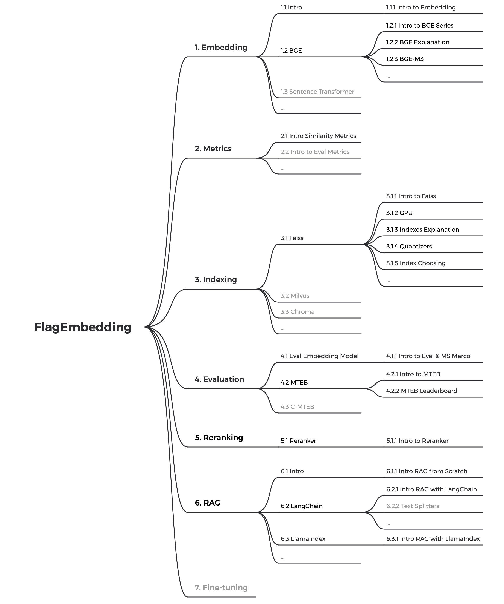

# FlagEmbedding_tutorial

If you are new to here, check out the 5 minute [quick start](./quick_start.ipynb)!

  
Tutorial roadmap

    

## [Embedding](./1_Embedding)

This module includes tutorials and demos showing how to use BGE and Sentence Transformers, as well as other embedding related topics.

## [Similarity](./2_Similarity)

In this part, we show popular similarity functions and techniques about searching.

## [Indexing](./3_Indexing)

Although not included in the quick start, indexing is a very important part in practical cases. This module shows how to use popular libraries like Faiss and Milvus to do indexing.

## [Evaluation](./4_Evaluation)

In this module, we'll show the full pipeline of evaluating an embedding model, as well as popular benchmarks like MTEB and C-MTEB.

## [Reranking](./5_Reranking/)

To balance accuracy and efficiency tradeoff, many retrieval system use a more efficient retriever to quickly narrow down the candidates. Then use more accurate models do reranking for the final results.
