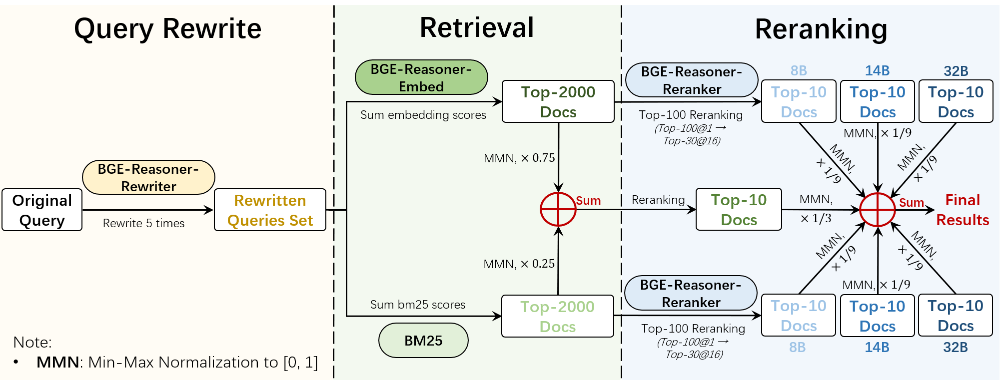
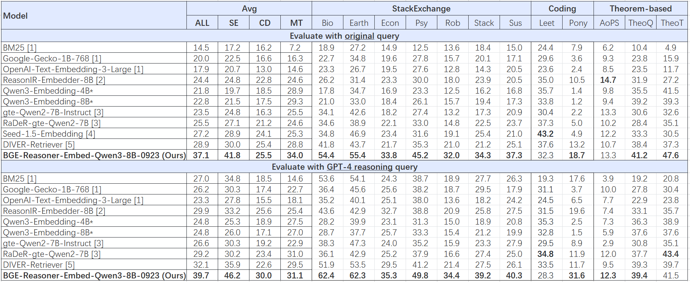

<h1> BGE-Reasoner: Towards End-to-End Reasoning-Intensive Information Retrieval </h1>

## Introduction

We introduce **BGE-Reasoner**, an end-to-end reasoning-intensive information retrieval framework. BGE-Reasoner is characterized by three key features:

1. **End-to-end**: It comprises three core components in IR—**BGE-Reasoner-Rewriter**, **BGE-Reasoner-Embed**, and **BGE-Reasoner-Reranker**—covering the entire retrieval pipeline, from query rewriting and retrieval to reranking for reasoning-intensive tasks.
2. **Excellent performance**: **BGE-Reasoner** achieves **state-of-the-art (SOTA)** performance on [BRIGHT](https://brightbenchmark.github.io/), a reasoning-intensive information retrieval benchmark, with an **nDCG@10 of 45.2** across 12 datasets (released on Aug 21, 2025), outperforming the previous SOTA by +3.6 points (41.6 from [DIVER](https://arxiv.org/pdf/2508.07995), Aug 12, 2025).
3. **Open-source resources**: We will release the code, model checkpoints, training data, and evaluation scripts to facilitate future research on reasoning-intensive information retrieval. Please stay tuned!

## Open-source resources

| Resource Type      | Name                  | Link              | Release Date | Comments |
| ------------------ | --------------------- | ----------- | ------------------ | ------------------ |
| Model              | BGE-Reasoner-Rewriter | [🤗]() (TBA)     | -    |      |
| Model              | BGE-Reasoner-Reranker | [🤗]() (TBA)     | -    |      |
| Model              | BGE-Reasoner-Embed-Qwen3-8B-0923 | [🤗](https://huggingface.co/BAAI/bge-reasoner-embed-qwen3-8b-0923) | Sep 23, 2025 | nDCG@10 = 37.1 using original query, fine-tuned on [Qwen/Qwen3-8B](https://huggingface.co/Qwen/Qwen3-8B) with our latest refined training data (data to be released) |
| Search Results | BGE-Reasoner-Embed-Qwen3-8B-0923 Search Results | [🤗](https://huggingface.co/BAAI/bge-reasoner-embed-qwen3-8b-0923/tree/main/search_results) | Sep 23, 2025 | nDCG@10 = 37.1 using original query |
| Search Results | BGE-Reasoner-Embed-0821 Search Results | [🤗](https://huggingface.co/datasets/hanhainebula/bright-search-results_bge-reasoner-embed-0821/tree/main) | Sep 4, 2025 | nDCG@10 = 32.5 using original query, submission to BRIGHT leaderboard on Aug 21, 2025 |
| Training Data      | BGE-Reasoner-Data | [🤗](https://huggingface.co/datasets/hanhainebula/bge-reasoner-data/tree/main/bge-reasoner-data-0904) | Sep 4, 2025 | part of our training data; full data to be released in the future |
| Evaluation Scripts | -                     | (TBA)             | -            |              |

## Performance

**BGE-Reasoner** achieves SOTA performance on the **BRIGHT** benchmark with the following pipeline:

1. **Query Rewrite**: **BGE-Reasoner-Rewriter** generates 5 rewritten queries for each original query; all 5 rewrites are used for retrieval.
2. **Retrieval**: For each rewritten query, **BGE-Reasoner-Embed** and **BM25** retrieve the top-2000 documents. We aggregate results across the 5 rewrites by summing the corresponding scores to produce a final score per method.
3. **Reranking**:
    - We rerank the top-100 documents from each retrieval method using **BGE-Reasoner-Reranker** (models: 8B, 14B, 32B), producing 6 reranked top-10 lists (2 retrieval methods × 3 reranker sizes).
    - We also create a hybrid top-10 by fusing **BGE-Reasoner-Embed** and **BM25** (weights: 0.75 / 0.25 after min–max normalization).
    - Finally, we combine the 7 top-10 lists (6 reranked + 1 hybrid) to produce the final top-10.

### Full Pipeline Results

Note:
- "**Avg - ALL**" refers to the average performance across **all 12 datasets** in the BRIGHT benchmark.
- "**Avg - SE**" refers to the average performance across the **7 datasets in the StackExchange subset** of the BRIGHT benchmark.
- "**Avg - CD**" refers to the average performance across the **2 datasets in the Coding subset** of the BRIGHT benchmark.
- "**Avg - MT**" refers to the average performance across the **3 datasets in the Theorem-based subset** of the BRIGHT benchmark.

> Sources of results:
>
> [1] https://arxiv.org/pdf/2504.20595
>
> [2] https://github.com/Debrup-61/RaDeR
>
> [3] https://huggingface.co/ielabgroup/Rank-R1-32B-v0.2
>
> [4] https://github.com/jataware/XRR2
>
> [5] http://arxiv.org/pdf/2508.07050
>
> [6] https://arxiv.org/pdf/2508.07995

### Embedder & Rewriter Results

#### BGE-Reasoner-Embed-Qwen3-8B-0923

**BGE-Reasoner-Embed-Qwen3-8B-0923**, fine-tuned on [Qwen/Qwen3-8B](https://huggingface.co/Qwen/Qwen3-8B) with our latest refined training data (data to be released), achieves strong performance on the BRIGHT benchmark:

- With original queries, it attains **nDCG@10 = 37.1**, an absolute improvement of **+8.2** over the previous best ([DIVER](https://arxiv.org/pdf/2508.07995): 28.9).
- Using the GPT-4 reasoning queries provided by BRIGHT, the score increases to **39.7**, which is **+7.6** higher than DIVER’s corresponding result (32.1).

> On Sep 23, 2025, we released the first-stage search results of BGE-Reasoner-Embed-Qwen3-8B-0923 using original queries and GPT-4 reasoning queries (Top-2000 candidates; excluded IDs removed) [here](https://huggingface.co/BAAI/bge-reasoner-embed-qwen3-8b-0923/tree/main/search_results). The model checkpoint is available [here](https://huggingface.co/BAAI/bge-reasoner-embed-qwen3-8b-0923).

Note:
- "**Avg - ALL**" refers to the average performance across **all 12 datasets** in the BRIGHT benchmark.
- "**Avg - SE**" refers to the average performance across the **7 datasets in the StackExchange subset** of the BRIGHT benchmark.
- "**Avg - CD**" refers to the average performance across the **2 datasets in the Coding subset** of the BRIGHT benchmark.
- "**Avg - MT**" refers to the average performance across the **3 datasets in the Theorem-based subset** of the BRIGHT benchmark.

> Sources of Results:
>
> [1] https://arxiv.org/pdf/2407.12883
>
> [2] https://arxiv.org/pdf/2504.20595
>
> [3] https://github.com/Debrup-61/RaDeR
>
> [4] https://seed1-5-embedding.github.io
>
> [5] https://arxiv.org/pdf/2508.07995
>
> *: results evaluated with our script

#### BGE-Reasoner-Embed-0821

**BGE-Reasoner-Embed-0821**, submitted to the BRIGHT leaderboard on Aug 21, 2025, achieves excellent performance on the benchmark:

- With original queries, it attains **nDCG@10 = 32.5**, an absolute improvement of **+3.6** over the previous best ([DIVER](https://arxiv.org/pdf/2508.07995): 28.9).
- Using the GPT-4 reasoning queries provided by BRIGHT, the score increases to **37.7**, which is **+5.6** higher than DIVER’s corresponding result (32.1). Combining our embedding-based retrieval with BM25 (hybrid fusion, weights: 0.75 / 0.25) yields **nDCG@10 = 40.2**.
- Finally, when using rewritten queries produced by **BGE-Reasoner-Rewriter** and fusing with BM25 (weights: 0.75 / 0.25), we reach **nDCG@10 = 40.8**.

> On Sep 4, 2025, we released the first-stage search results of BGE-Reasoner-Embed-0821 using original queries and GPT-4 reasoning queries (Top-2000 candidates; excluded IDs removed) [here](https://huggingface.co/datasets/hanhainebula/bright-search-results_bge-reasoner-embed-0821/tree/main). The model checkpoint will not be released due to its suboptimal performance compared to BGE-Reasoner-Embed-Qwen3-8B-0923.

Note:
- "**Avg - ALL**" refers to the average performance across **all 12 datasets** in the BRIGHT benchmark.
- "**Avg - SE**" refers to the average performance across the **7 datasets in the StackExchange subset** of the BRIGHT benchmark.
- "**Avg - CD**" refers to the average performance across the **2 datasets in the Coding subset** of the BRIGHT benchmark.
- "**Avg - MT**" refers to the average performance across the **3 datasets in the Theorem-based subset** of the BRIGHT benchmark.

> Sources of Results:
>
> [1] https://arxiv.org/pdf/2407.12883
>
> [2] https://arxiv.org/pdf/2504.20595
>
> [3] https://github.com/Debrup-61/RaDeR
>
> [4] https://seed1-5-embedding.github.io
>
> [5] https://arxiv.org/pdf/2508.07995
>
> *: results evaluated with our script

## Technical Details

The technical details for each component of **BGE-Reasoner** will be released soon. Please stay tuned!

## Contact Information

Some resources are not yet publicly available. If you have urgent research needs for any of these resources (e.g., model checkpoints, search results, evaluation scripts) or have any questions, please contact Jianlyu Chen at jianlvchen@gmail.com.

## Citation

TBA
