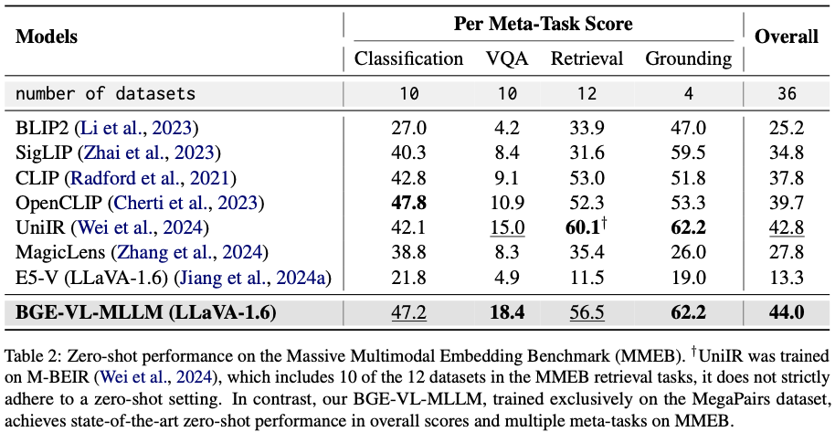
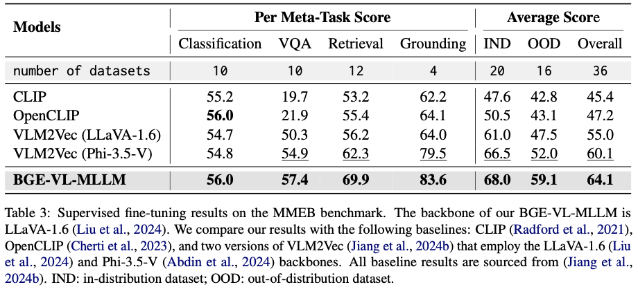
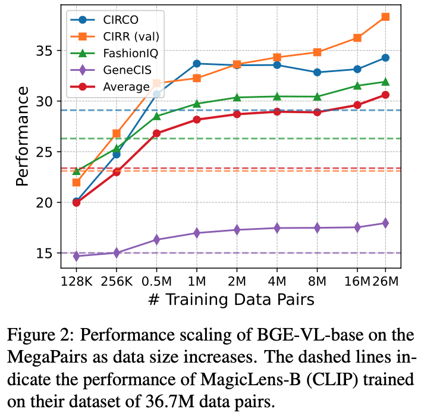

<h1 align="center">MegaPairs: Massive Data Synthesis For Universal Multimodal Retrieval</h1>

<p align="center">
    <a href="https://arxiv.org/abs/2412.14475">
        
    </a>
    <a href="https://github.com/VectorSpaceLab/MegaPairs">
        
    </a>
    <a href="https://huggingface.co/datasets/JUNJIE99/MegaPairs">
        
</p>

<p align="center">
</a>
    <a href="https://huggingface.co/BAAI/BGE-VL-base">
        
    </a>
    <a href="https://huggingface.co/BAAI/BGE-VL-large">
        
    </a>
    <a href="https://huggingface.co/BAAI/BGE-VL-MLLM-S1">
        
    </a>
    <a href="https://huggingface.co/BAAI/BGE-VL-MLLM-S2">
        
    </a>
</p>
<p align="center">


## News
```2025-4-13``` 🎉🎉 We have uploaded our MegaPairs dataset to [🤗Hugging Face](https://huggingface.co/datasets/JUNJIE99/MegaPairs), which contains over 26 million multimodal retrieval instruction-tuning triplets. To reduce upload time and enhance data accessibility, we resized all images to a resolution of 512 × 512 instead of using their original size. This adjustment has minimal impact on performance, considering that most vision-language models (e.g., CLIP) use even smaller input image sizes. [Dataset Card](https://github.com/VectorSpaceLab/MegaPairs?tab=readme-ov-file#megapairs-dataset-card)

```2025-4-2``` 🌟🌟 BGE-VL models are also available on [WiseModel](https://www.wisemodel.cn/models/JUNJIE99/BGE-VL-large).

```2025-3-6``` 📰📰 Thank you to [SyncedTech (机器之心)](https://mp.weixin.qq.com/s/iw9BmSDwv6NYtD7pkC5kxQ), [QbitAI (量子位)](https://mp.weixin.qq.com/s/r_zWAZ0ir5732OfIrEsDtg), and [AI Era (新智元)](https://mp.weixin.qq.com/s/FZwKYJnx_78YDAEreu1edg) for reporting on our work!

```2025-3-4``` 🚀🚀 We have released the BGE-VL-MLLM models on Huggingface: [BGE-VL-MLLM-S1](https://huggingface.co/BAAI/BGE-VL-MLLM-S1) and [BGE-VL-MLLM-S2](https://huggingface.co/BAAI/BGE-VL-MLLM-S2). **BGE-VL-MLLM-S1** is trained exclusively on our MegaPairs dataset, achieving outstanding performance in composed image retrieval, with an 8.1% improvement on the CIRCO benchmark (mAP@5) over the previous state-of-the-art. **BGE-VL-MLLM-S2** builds on BGE-VL-MLLM-S1 with an additional epoch of fine-tuning on the MMEB benchmark training set, delivering enhanced performance across a broader range of multimodal embedding tasks.

```2024-12-27``` 🚀🚀 BGE-VL-CLIP models are released on Huggingface: [BGE-VL-base](https://huggingface.co/BAAI/BGE-VL-base) and [BGE-VL-large](https://huggingface.co/BAAI/BGE-VL-large).

```2024-12-19``` 🎉🎉 Release our paper: [MegaPairs: Massive Data Synthesis For Universal Multimodal Retrieval](https://arxiv.org/pdf/2412.14475).

## Release Plan
- [x] Paper
- [x] BGE-VL-base and BGE-VL-large models
- [x] BGE-VL-MLLM model
- [x] MegaPairs Dataset
- [x] Evaluation code examples
- [ ] Fine-tuning code


## Introduction
In this work, we introduce **MegaPairs**, a novel data synthesis method that leverages open-domain images to create *heterogeneous KNN triplets* for universal multimodal retrieval. Our MegaPairs dataset contains over 26 million triplets, and we have trained a series of multimodal retrieval models, **BGE-VL**, including BGE-VL-CLIP (base and large) and BGE-VL-MLLM.

BGE-VL achieve state-of-the-art performance on four popular zero-shot composed image retrieval benchmarks and the massive multimodal embedding benchmark (MMEB). Extensive experiments demonstrate the ***efficiency, scalability, and generalization*** features of MegaPairs. Please refer to our [paper](https://arxiv.org/abs/2412.14475) for more details.


## Model Usage

### 1. BGE-VL-CLIP Models
You can easily use BGE-VL-CLIP models based on ```transformers```
> Our code works well on transformers==4.45.2, and we recommend using this version.
```python
import torch
from transformers import AutoModel

MODEL_NAME = "BAAI/BGE-VL-base" # or "BAAI/BGE-VL-large"

model = AutoModel.from_pretrained(MODEL_NAME, trust_remote_code=True) # You must set trust_remote_code=True
model.set_processor(MODEL_NAME)
model.eval()

with torch.no_grad():
    query = model.encode(
        images = "./assets/cir_query.png", 
        text = "Make the background dark, as if the camera has taken the photo at night"
    )

    candidates = model.encode(
        images = ["./assets/cir_candi_1.png", "./assets/cir_candi_2.png"]
    )
    
    scores = query @ candidates.T
print(scores)
```

See the [demo](./retrieval_demo.ipynb) for a complete example of using BGE-VL for multimodel retrieval.


### 2. BGE-VL-MLLM Models

> Our code works well on transformers==4.45.2, and we recommend using this version.

```python
import torch
from transformers import AutoModel
from PIL import Image

MODEL_NAME= "BAAI/BGE-VL-MLLM-S1"

model = AutoModel.from_pretrained(MODEL_NAME, trust_remote_code=True)
model.eval()
model.cuda()

with torch.no_grad():
    model.set_processor(MODEL_NAME)

    query_inputs = model.data_process(
        text="Make the background dark, as if the camera has taken the photo at night", 
        images="./assets/cir_query.png",
        q_or_c="q",
        task_instruction="Retrieve the target image that best meets the combined criteria by using both the provided image and the image retrieval instructions: "
    )

    candidate_inputs = model.data_process(
        images=["./assets/cir_candi_1.png", "./assets/cir_candi_2.png"],
        q_or_c="c",
    )

    query_embs = model(**query_inputs, output_hidden_states=True)[:, -1, :]
    candi_embs = model(**candidate_inputs, output_hidden_states=True)[:, -1, :]
    
    query_embs = torch.nn.functional.normalize(query_embs, dim=-1)
    candi_embs = torch.nn.functional.normalize(candi_embs, dim=-1)

    scores = torch.matmul(query_embs, candi_embs.T)
print(scores)
```

## MegaPairs Dataset Card

We are excited to release the **MegaPairs** dataset on [Hugging Face](https://huggingface.co/datasets/JUNJIE99/MegaPairs), which contains over **26 million training samples** tailored for composed image retrieval and universal multimodal retrieval tasks. 

### Dataset Structure

Each entry in the dataset consists of the following fields:

- **q_img**: `str`  
  The file path to the query image.

- **q_text**: `list`  
  A list of textual query statements related to the query image. During training, you can randomly select one statement from this list.

- **t_img**: `str`  
  The file path to the target image, which serves as the **positive example** for the combination of `q_img` and `q_text`.

- **hns**: `list`  
  A list of file paths for **hard negative sample** images. These are challenging distractors that are visually or semantically similar to the query. It is recommended to include at least one hard negative sample during training, with **`hns[0]` (the query image itself)** being a mandatory choice. In our experiments, we used **four hard negative samples** per query.


### Usage

The dataset is available for download and exploration on [Hugging Face](https://huggingface.co/datasets/JUNJIE99/MegaPairs). We encourage researchers and practitioners to leverage this dataset to advance multimodal retrieval research and systems.

## Model Performance
### Zero-Shot Composed Image Retrieval

BGE-VL sets a new performance benchmark in zero-shot composed image retrieval tasks. On the CIRCO benchmark, our BGE-VL-base model, with only 149 million parameters, surpasses all previous models, including those with 50 times more parameters. Additionally, BGE-VL-MLLM achieves an 8.1% improvement over the previous state-of-the-art model.


### Zero-Shot Performance on MMEB

BGE-VL-MLLM achieves state-of-the-art zero-shot performance on the Massive Multimodal Embedding Benchmark (MMEB), despite being trained only on the ImageText-to-Image paradigm. This demonstrates the excellent generalization capability of MegaPairs for multimodal embedding.



### Fine-Tuning Performance on MMEB

After fine-tuning on downstream tasks, BGE-VL-MLLM maintains its leading performance. Notably, it surpasses the previous state-of-the-art by 7.1% on the MMEB out-of-distribution (OOD) set. These results demonstrate the robust generalization capability of BGE-VL-MLLM and highlight the potential of MegaPairs as foundational training data for universal multimodal embedding.



### Performance Scaling
MegaPairs showcases **scalability**: BGE-VL-base improves as training data increases. It also demonstrates **efficiency**: with just 0.5M training samples, BGE-VL-base significantly outperforms MagicLens, which uses the same CLIP-base backbone and was trained on 36.7M samples.




## License
The annotations for MegaPairs and the BGE-VL models are released under the [MIT License](LICENSE). The images in MegaPairs originate from the [Recap-Datacomp](https://huggingface.co/datasets/UCSC-VLAA/Recap-DataComp-1B), which is released under the CC BY 4.0 license.


## Citation
If you find this repository useful, please consider giving a star ⭐ and citation

```
@article{zhou2024megapairs,
  title={MegaPairs: Massive Data Synthesis For Universal Multimodal Retrieval},
  author={Zhou, Junjie and Liu, Zheng and Liu, Ze and Xiao, Shitao and Wang, Yueze and Zhao, Bo and Zhang, Chen Jason and Lian, Defu and Xiong, Yongping},
  journal={arXiv preprint arXiv:2412.14475},
  year={2024}
}
```
