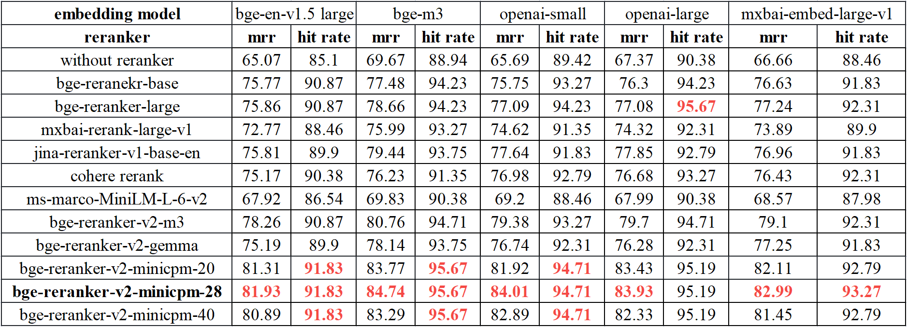
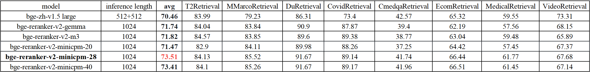

# Reranker

- [Model List](#model-list)
- [Usage](#usage)
- [Fine-tuning](#fine-tune)
- [Evaluate Script](#evaluate-script)
- [Evaluation](#evaluation)
- [Citation](#citation)

Different from embedding model, reranker uses question and document as input and directly output similarity instead of embedding. 
You can get a relevance score by inputting query and passage to the reranker. 
And the score can be mapped to a float value in [0,1] by sigmoid function.


## Model List

| Model                                                                     | Base model                                                           | Language | layerwise |                           feature                            |
|:--------------------------------------------------------------------------|:--------:|:-----------------------------------------------------------------------------------------------------------------------------------:|:----------------------------------------------------------------------------------------------:|:----------------------------------------------------------------------------------------------:|
| [BAAI/bge-reranker-base](https://huggingface.co/BAAI/bge-reranker-base) | [xlm-roberta-base](https://huggingface.co/xlm-roberta-base) | Chinese and English |     -     | Lightweight reranker model, easy to deploy, with fast inference. |
| [BAAI/bge-reranker-large](https://huggingface.co/BAAI/bge-reranker-large) | [xlm-roberta-large](https://huggingface.co/FacebookAI/xlm-roberta-large) | Chinese and English |     -     | Lightweight reranker model, easy to deploy, with fast inference. |
| [BAAI/bge-reranker-v2-m3](https://huggingface.co/BAAI/bge-reranker-v2-m3) | [bge-m3](https://huggingface.co/BAAI/bge-m3) |    Multilingual     |     -     | Lightweight reranker model, possesses strong multilingual capabilities, easy to deploy, with fast inference. |
| [BAAI/bge-reranker-v2-gemma](https://huggingface.co/BAAI/bge-reranker-v2-gemma) | [gemma-2b](https://huggingface.co/google/gemma-2b) |    Multilingual     |     -     | Suitable for multilingual contexts, performs well in both English proficiency and multilingual capabilities. |
| [BAAI/bge-reranker-v2-minicpm-layerwise](https://huggingface.co/BAAI/bge-reranker-v2-minicpm-layerwise) | [MiniCPM-2B-dpo-bf16](https://huggingface.co/openbmb/MiniCPM-2B-dpo-bf16) |    Multilingual     |   8-40    | Suitable for multilingual contexts, performs well in both English and Chinese proficiency, allows freedom to select layers for output, facilitating accelerated inference. |


You can select the model according your senario and resource. 
- For **multilingual**, utilize [BAAI/bge-reranker-v2-m3](https://huggingface.co/BAAI/bge-reranker-v2-m3) and [BAAI/bge-reranker-v2-gemma](https://huggingface.co/BAAI/bge-reranker-v2-gemma)

- For **Chinese or English**, utilize [BAAI/bge-reranker-v2-m3](https://huggingface.co/BAAI/bge-reranker-v2-m3) and [BAAI/bge-reranker-v2-minicpm-layerwise](https://huggingface.co/BAAI/bge-reranker-v2-minicpm-layerwise). 

- For **efficiency**, utilize [BAAI/bge-reranker-v2-m3](https://huggingface.co/BAAI/bge-reranker-v2-m3) and the low layer of [BAAI/bge-reranker-v2-minicpm-layerwise](https://huggingface.co/BAAI/bge-reranker-v2-minicpm-layerwise). 

- For better performance, recommand [BAAI/bge-reranker-v2-minicpm-layerwise](https://huggingface.co/BAAI/bge-reranker-v2-minicpm-layerwise) and [BAAI/bge-reranker-v2-gemma](https://huggingface.co/BAAI/bge-reranker-v2-gemma)

## Usage 
### Using FlagEmbedding

```
pip install -U FlagEmbedding
```

#### For normal reranker (bge-reranker-base / bge-reranker-large / bge-reranker-v2-m3 )

Get relevance scores (higher scores indicate more relevance):

```python
from FlagEmbedding import FlagReranker
reranker = FlagReranker('BAAI/bge-reranker-v2-m3', use_fp16=True) # Setting use_fp16 to True speeds up computation with a slight performance degradation

score = reranker.compute_score(['query', 'passage'])
print(score) # -5.65234375

# You can map the scores into 0-1 by set "normalize=True", which will apply sigmoid function to the score
score = reranker.compute_score(['query', 'passage'], normalize=True)
print(score) # 0.003497010252573502

scores = reranker.compute_score([['what is panda?', 'hi'], ['what is panda?', 'The giant panda (Ailuropoda melanoleuca), sometimes called a panda bear or simply panda, is a bear species endemic to China.']])
print(scores) # [-8.1875, 5.26171875]

# You can map the scores into 0-1 by set "normalize=True", which will apply sigmoid function to the score
scores = reranker.compute_score([['what is panda?', 'hi'], ['what is panda?', 'The giant panda (Ailuropoda melanoleuca), sometimes called a panda bear or simply panda, is a bear species endemic to China.']], normalize=True)
print(scores) # [0.00027803096387751553, 0.9948403768236574]
```

#### For LLM-based reranker

```python
from FlagEmbedding import FlagLLMReranker
reranker = FlagLLMReranker('BAAI/bge-reranker-v2-gemma', use_fp16=True) # Setting use_fp16 to True speeds up computation with a slight performance degradation
# reranker = FlagLLMReranker('BAAI/bge-reranker-v2-gemma', use_bf16=True) # You can also set use_bf16=True to speed up computation with a slight performance degradation

score = reranker.compute_score(['query', 'passage'])
print(score)

scores = reranker.compute_score([['what is panda?', 'hi'], ['what is panda?', 'The giant panda (Ailuropoda melanoleuca), sometimes called a panda bear or simply panda, is a bear species endemic to China.']])
print(scores)
```

#### For LLM-based layerwise reranker

```python
from FlagEmbedding import LayerWiseFlagLLMReranker
reranker = LayerWiseFlagLLMReranker('BAAI/bge-reranker-v2-minicpm-layerwise', use_fp16=True) # Setting use_fp16 to True speeds up computation with a slight performance degradation
# reranker = LayerWiseFlagLLMReranker('BAAI/bge-reranker-v2-minicpm-layerwise', use_bf16=True) # You can also set use_bf16=True to speed up computation with a slight performance degradation

score = reranker.compute_score(['query', 'passage'], cutoff_layers=[28]) # Adjusting 'cutoff_layers' to pick which layers are used for computing the score.
print(score)

scores = reranker.compute_score([['what is panda?', 'hi'], ['what is panda?', 'The giant panda (Ailuropoda melanoleuca), sometimes called a panda bear or simply panda, is a bear species endemic to China.']], cutoff_layers=[28])
print(scores)
```

### Using Huggingface transformers

#### For normal reranker (bge-reranker-base / bge-reranker-large / bge-reranker-v2-m3 )

Get relevance scores (higher scores indicate more relevance):

```python
import torch
from transformers import AutoModelForSequenceClassification, AutoTokenizer

tokenizer = AutoTokenizer.from_pretrained('BAAI/bge-reranker-v2-m3')
model = AutoModelForSequenceClassification.from_pretrained('BAAI/bge-reranker-v2-m3')
model.eval()

pairs = [['what is panda?', 'hi'], ['what is panda?', 'The giant panda (Ailuropoda melanoleuca), sometimes called a panda bear or simply panda, is a bear species endemic to China.']]
with torch.no_grad():
    inputs = tokenizer(pairs, padding=True, truncation=True, return_tensors='pt', max_length=512)
    scores = model(**inputs, return_dict=True).logits.view(-1, ).float()
    print(scores)
```

#### For LLM-based reranker

```python
import torch
from transformers import AutoModelForCausalLM, AutoTokenizer

def get_inputs(pairs, tokenizer, prompt=None, max_length=1024):
    if prompt is None:
        prompt = "Given a query A and a passage B, determine whether the passage contains an answer to the query by providing a prediction of either 'Yes' or 'No'."
    sep = "\n"
    prompt_inputs = tokenizer(prompt,
                              return_tensors=None,
                              add_special_tokens=False)['input_ids']
    sep_inputs = tokenizer(sep,
                           return_tensors=None,
                           add_special_tokens=False)['input_ids']
    inputs = []
    for query, passage in pairs:
        query_inputs = tokenizer(f'A: {query}',
                                 return_tensors=None,
                                 add_special_tokens=False,
                                 max_length=max_length * 3 // 4,
                                 truncation=True)
        passage_inputs = tokenizer(f'B: {passage}',
                                   return_tensors=None,
                                   add_special_tokens=False,
                                   max_length=max_length,
                                   truncation=True)
        item = tokenizer.prepare_for_model(
            [tokenizer.bos_token_id] + query_inputs['input_ids'],
            sep_inputs + passage_inputs['input_ids'],
            truncation='only_second',
            max_length=max_length,
            padding=False,
            return_attention_mask=False,
            return_token_type_ids=False,
            add_special_tokens=False
        )
        item['input_ids'] = item['input_ids'] + sep_inputs + prompt_inputs
        item['attention_mask'] = [1] * len(item['input_ids'])
        inputs.append(item)
    return tokenizer.pad(
            inputs,
            padding=True,
            max_length=max_length + len(sep_inputs) + len(prompt_inputs),
            pad_to_multiple_of=8,
            return_tensors='pt',
    )

tokenizer = AutoTokenizer.from_pretrained('BAAI/bge-reranker-v2-gemma')
model = AutoModelForCausalLM.from_pretrained('BAAI/bge-reranker-v2-gemma')
yes_loc = tokenizer('Yes', add_special_tokens=False)['input_ids'][0]
model.eval()

pairs = [['what is panda?', 'hi'], ['what is panda?', 'The giant panda (Ailuropoda melanoleuca), sometimes called a panda bear or simply panda, is a bear species endemic to China.']]
with torch.no_grad():
    inputs = get_inputs(pairs, tokenizer)
    scores = model(**inputs, return_dict=True).logits[:, -1, yes_loc].view(-1, ).float()
    print(scores)
```

#### For LLM-based layerwise reranker

```python
import torch
from transformers import AutoModelForCausalLM, AutoTokenizer

def get_inputs(pairs, tokenizer, prompt=None, max_length=1024):
    if prompt is None:
        prompt = "Given a query A and a passage B, determine whether the passage contains an answer to the query by providing a prediction of either 'Yes' or 'No'."
    sep = "\n"
    prompt_inputs = tokenizer(prompt,
                              return_tensors=None,
                              add_special_tokens=False)['input_ids']
    sep_inputs = tokenizer(sep,
                           return_tensors=None,
                           add_special_tokens=False)['input_ids']
    inputs = []
    for query, passage in pairs:
        query_inputs = tokenizer(f'A: {query}',
                                 return_tensors=None,
                                 add_special_tokens=False,
                                 max_length=max_length * 3 // 4,
                                 truncation=True)
        passage_inputs = tokenizer(f'B: {passage}',
                                   return_tensors=None,
                                   add_special_tokens=False,
                                   max_length=max_length,
                                   truncation=True)
        item = tokenizer.prepare_for_model(
            [tokenizer.bos_token_id] + query_inputs['input_ids'],
            sep_inputs + passage_inputs['input_ids'],
            truncation='only_second',
            max_length=max_length,
            padding=False,
            return_attention_mask=False,
            return_token_type_ids=False,
            add_special_tokens=False
        )
        item['input_ids'] = item['input_ids'] + sep_inputs + prompt_inputs
        item['attention_mask'] = [1] * len(item['input_ids'])
        inputs.append(item)
    return tokenizer.pad(
            inputs,
            padding=True,
            max_length=max_length + len(sep_inputs) + len(prompt_inputs),
            pad_to_multiple_of=8,
            return_tensors='pt',
    )

tokenizer = AutoTokenizer.from_pretrained('BAAI/bge-reranker-v2-minicpm-layerwise', trust_remote_code=True)
model = AutoModelForCausalLM.from_pretrained('BAAI/bge-reranker-v2-minicpm-layerwise', trust_remote_code=True, torch_dtype=torch.bfloat16)
model = model.to('cuda')
model.eval()

pairs = [['what is panda?', 'hi'], ['what is panda?', 'The giant panda (Ailuropoda melanoleuca), sometimes called a panda bear or simply panda, is a bear species endemic to China.']]
with torch.no_grad():
    inputs = get_inputs(pairs, tokenizer).to(model.device)
    all_scores = model(**inputs, return_dict=True, cutoff_layers=[28])
    all_scores = [scores[:, -1].view(-1, ).float() for scores in all_scores[0]]
    print(all_scores)
```

## Fine-tune

### Data Format

Train data should be a json file, where each line is a dict like this:

```
{"query": str, "pos": List[str], "neg":List[str], "prompt": str}
```

`query` is the query, and `pos` is a list of positive texts, `neg` is a list of negative texts, `prompt` indicates the relationship between query and texts. If you have no negative texts for a query, you can random sample some from the entire corpus as the negatives.

See [toy_finetune_data.jsonl](https://github.com/FlagOpen/FlagEmbedding/tree/master/FlagEmbedding/llm_reranker/toy_finetune_data.jsonl) for a toy data file.

### Train

You can fine-tune the reranker with the following code:

**For normal reranker** (bge-reranker-base / bge-reranker-large / bge-reranker-v2-m3 )

Refer to: https://github.com/FlagOpen/FlagEmbedding/tree/master/examples/reranker

**For llm-based reranker** (bge-reranker-v2-gemma)

```shell
torchrun --nproc_per_node {number of gpus} \
-m FlagEmbedding.llm_reranker.finetune_for_instruction.run \
--output_dir {path to save model} \
--model_name_or_path google/gemma-2b \
--train_data ./toy_finetune_data.jsonl \
--learning_rate 2e-4 \
--num_train_epochs 1 \
--per_device_train_batch_size 1 \
--gradient_accumulation_steps 16 \
--dataloader_drop_last True \
--query_max_len 512 \
--passage_max_len 512 \
--train_group_size 16 \
--logging_steps 1 \
--save_steps 2000 \
--save_total_limit 50 \
--ddp_find_unused_parameters False \
--gradient_checkpointing \
--deepspeed stage1.json \
--warmup_ratio 0.1 \
--bf16 \
--use_lora True \
--lora_rank 32 \
--lora_alpha 64 \
--use_flash_attn True \
--target_modules q_proj k_proj v_proj o_proj
```

**For llm-based layerwise reranker** (bge-reranker-v2-minicpm-layerwise) 

```shell
torchrun --nproc_per_node {number of gpus} \
-m FlagEmbedding.llm_reranker.finetune_for_layerwise.run \
--output_dir {path to save model} \
--model_name_or_path openbmb/MiniCPM-2B-dpo-bf16 \
--train_data ./toy_finetune_data.jsonl \
--learning_rate 2e-4 \
--num_train_epochs 1 \
--per_device_train_batch_size 1 \
--gradient_accumulation_steps 16 \
--dataloader_drop_last True \
--query_max_len 512 \
--passage_max_len 512 \
--train_group_size 16 \
--logging_steps 1 \
--save_steps 2000 \
--save_total_limit 50 \
--ddp_find_unused_parameters False \
--gradient_checkpointing \
--deepspeed stage1.json \
--warmup_ratio 0.1 \
--bf16 \
--use_lora True \
--lora_rank 32 \
--lora_alpha 64 \
--use_flash_attn True \
--target_modules q_proj k_proj v_proj o_proj \
--start_layer 8 \
--head_multi True \
--head_type simple \
--lora_extra_parameters linear_head \
--finetune_type from_raw_model # should be one of ['from_raw_model', 'from_finetuned_model']
```

Our rerankers are initialized from [google/gemma-2b](https://huggingface.co/google/gemma-2b) (for llm-based reranker) and [openbmb/MiniCPM-2B-dpo-bf16](https://huggingface.co/openbmb/MiniCPM-2B-dpo-bf16) (for llm-based layerwise reranker), and we train it on a mixture of multilingual datasets:

- [bge-m3-data](https://huggingface.co/datasets/Shitao/bge-m3-data)
- [quora train data](https://huggingface.co/datasets/quora)
- [fever train data](https://fever.ai/dataset/fever.html)

### Merge Model

After finetune, you need to merge the model

**For llm-based reranker**

```python
from FlagEmbedding.llm_reranker.merge import merge_llm
merge_llm('google/gemma-2b', 'lora_llm_output_path', 'merged_model_output_paths')
```

**For llm-based layerwise reranker**

If you finetune the raw model (openbmb/MiniCPM-2B-dpo-bf16)

```shell
from FlagEmbedding.llm_reranker.merge import merge_layerwise_raw_llm
merge_layerwise_raw_llm('openbmb/MiniCPM-2B-dpo-bf16', 'lora_llm_output_path', 'merged_model_output_paths')
```

If you finetune the finetuned model (BAAI/bge-reranker-v2-minicpm-layerwise)

```shell
from FlagEmbedding.llm_reranker.merge import merge_layerwise_finetuned_llm
merge_layerwise_finetuned_llm('BAAI/bge-reranker-v2-minicpm-layerwise', 'lora_llm_output_path', 'merged_model_output_paths')
```

Then you can replace the `config.json` in `merged_model_output_paths` with the `config.json` from [BAAI/bge-reranker-v2-minicpm-layerwise.](https://huggingface.co/BAAI/bge-reranker-v2-minicpm-layerwise/blob/main/config.json)

### Load llm-based layerwise reranker in local

If you download reranker-v2-minicpm-layerwise, you can load it with the following method:
1. make sure `configuration_minicpm_reranker.py` and `modeling_minicpm_reranker.py` in `/path/bge-reranker-v2-minicpm-layerwise`.
2. modify the following part of `config.json`:
```
"auto_map": {
    "AutoConfig": "configuration_minicpm_reranker.LayerWiseMiniCPMConfig",
    "AutoModel": "modeling_minicpm_reranker.LayerWiseMiniCPMModel",
    "AutoModelForCausalLM": "modeling_minicpm_reranker.LayerWiseMiniCPMForCausalLM"
  },
```

## Evaluate Script

```shell
python evaluate.py \
--input_path ./toy_finetune_data.jsonl \
--metrics mrr recall ndcg map precision \
--k_values 1 10 100
```

If you want to use another reranker, please replace `reranker = FlagReranker('BAAI/bge-reranker-v2-m3', cache_dir=cache_dir, use_fp16=use_fp16)` with your own reranker.

## Evaluation

- llama-index.




- BEIR.   

rerank the top 100 results from bge-en-v1.5 large.


rerank the top 100 results from e5 mistral 7b instruct.


- CMTEB-retrieval.   
It rerank the top 100 results from bge-zh-v1.5 large.



- miracl (multi-language).   
It rerank the top 100 results from bge-m3.


## Citation

If you find this repository useful, please consider giving a star :star: and citation

```
@misc{li2023making,
      title={Making Large Language Models A Better Foundation For Dense Retrieval}, 
      author={Chaofan Li and Zheng Liu and Shitao Xiao and Yingxia Shao},
      year={2023},
      eprint={2312.15503},
      archivePrefix={arXiv},
      primaryClass={cs.CL}
}
@misc{chen2024bge,
      title={BGE M3-Embedding: Multi-Lingual, Multi-Functionality, Multi-Granularity Text Embeddings Through Self-Knowledge Distillation}, 
      author={Jianlv Chen and Shitao Xiao and Peitian Zhang and Kun Luo and Defu Lian and Zheng Liu},
      year={2024},
      eprint={2402.03216},
      archivePrefix={arXiv},
      primaryClass={cs.CL}
}
```
